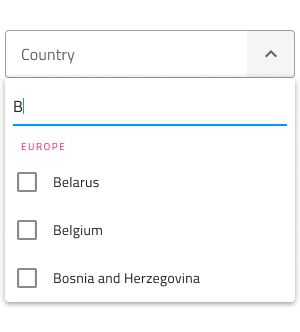

# Combo (コンボ)

Combo コンポーネントを使用して、事前定義された選択肢のリストからオプションを選択したり、独自の値を入力したりすることができます。ユーザーが下矢印アイコンをクリックすると、オプションのドロップダウン リストが表示され、1 つまたは複数のオプションを選択したり、値を検索したり、テキスト ボックスに独自の値を入力したりできます。Combo は、[Ignite UI for Angular Combobox コンポーネント](https://jp.infragistics.com/products/ignite-ui-angular/angular/components/combo.html)と視覚的に同じです。

> [!Note]
> Combo には複数選択によるコンボ `(Combo)` と [Single Select Combo (Simple Combo)](simple-combo.md) の2 つのレイアウト オプションがあります。

## Combo のデモ

Combo は 2 つのパーツに分かれます。現在の選択またはプレースホルダーを含む Input と 1 つ以上の項目を選択するために表示する Dropdown。

## Combo Input タイプ

Figma の Combo Input では border (枠線) タイプ (単色背景でよりはっきりと表示)と、より読みやすくするために鮮明な画像の上に配置する際に最適な box (ボックス) タイプから選択が可能です。

| Border | Box |
| ------- | ------- |
|  |  |

Combo Input には Prefix コンテナーがあり、`Prefix Container` ブール値プロパティで**オン・オフ**を切り替えられます。Label と Hint も同様にブール値プロパティで**オン・オフ**できます。

| Prefix 付き | Label 付き | Hint 付き | 
| ------- | ------- | ------- |
|  |  |  |
|  |  |  |

## サイズ

Combo には 3 つのサイズがあります。

- Large (大)
- Medium (中)
- Small (小)

Dropdown は選択されたサイズ バリアントに合わせて自動的に寸法が調整されます。

## インタラクション状態

Figma では border タイプと box タイプの Combo を Disabled 状態に設定できます。

## 状態

Combo コンポーネントは Enabled バリアントに対して 5 つの状態 (**Idle**、**Idle & Hover**、**Filled**、**Filled & Hover**、**Focused**) と、3 つのバリデーション状態 (**Success**、**Warn**、**Error**) をサポートします。プロパティ パネルから Combo の状態変更や Dropdown の表示切り替えが容易に行え、ネストされた Dropdown コンポーネントではコンテンツのさらに細かな調整が可能です。柔軟性が向上したことにより、Hi-Fi プロトタイプへシームレスにフローする動的なインタラクション デザインの作成が可能です。

経験豊富なデザイナーは、ユーザー入力を制限して無効な状態を防止するために、検証スタイルを使用します。Combo Input の検証スタイルには統一感のある標準 [Input](input.md) があり、成功、警告、エラーを表示する洗練されたデザインを提供します。

| Success | Warn | Error | 
| ------- | ------- | ------- |
|  |  |  |
|  |  |  |

Figma では、状態の変更はプロパティ パネルの `State` プロパティを介して行われます。

## Dropdown サイズ

Combo に使用される Dropdown は、標準 [Dropdown](dropdown.md) コンポーネント同様に Large、Medium、および Small に適切なサイズがサポートされます。Combo Dropdown はブール値プロパティから**オン・オフ**を切り替えることができ、入力に視覚的に影響を与える可能性がありますが、これは予期された動作です。

## Dropdown Search Input (ドロップダウン検索入力)

Figma では、Dropdown には、標準の [Input](input.md) と同様に、状態の選択とレイアウトのオプションが付属する Search Input が含まれています。

## Dropdown Items (ドロップダウン項目)

Combo に使用される Dropdown は、ヘッダーと複数選択項目の 2 種類の項目をサポートします。どちらも Large、Medium、Small の各サイズが利用できます。ヘッダーを介して、項目をグループに体系化できます。Figma では、Dropdown は、1 つまたは複数の項目がレイヤー パネルから非表示になると、レイアウトを調整する自動レイアウト オプションを利用します。

## Dropdown Item の状態

Combo 内のドロップダウン項目は、**Idle (アイドル)**、**Hover (ホバー)**、**Focused (フォーカス済み)** の 3 つの異なる状態をサポートします。**Disabled (無効)** および **Selected (選択済み)** の状態はブール値プロパティからオンとオフを切り替えることができます。

| Idle | Hover | Focused | Disabled |
| ---- | ----- | ------- | -------- |
|  |  |  |  |
| 選択済み |  |  |  |

## スタイル設定

Combo は入力とドロップダウン部分でスタイルの組み合わせに柔軟性があります。入力テキスト要素の色、境界線のスタイルおよび色のオプションが利用できます。Dropdown の場合、背景色を変更するか、Search Input や背景色とテキスト色の項目など、Combo Dropdown の項目に関連するさまざまなオプションを使用できます。

## 使用方法

Combo を使用する際に入力とドロップダウンは同じ幅で左右の境界線が一致する必要があります。Combo がフォーカスされたときのドロップダウンの表示は、Combo が表示をトリガーしたあとに常にコンテンツの上に表示する必要があります。Combo は、コンテンツを展開パネルのようにはプッシュしません。

| 良い例                                                                           |悪い例                                                                            |
| ---------------------------------------------------------------------------- | -------------------------------------------------------------------------------- |
|  |  |
|  |  |

## その他のリソース

関連トピック:

- [Simple Combo](simple-combo.md)
- [Dropdown](dropdown.md)
- [Form パターン](../patterns/form.md)
- [Input](input.md)
  

コミュニティに参加して新しいアイデアをご提案ください。
