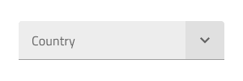
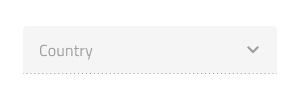
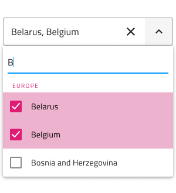
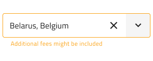
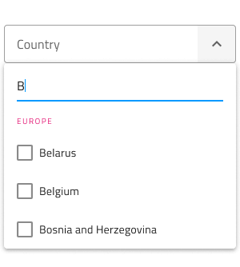
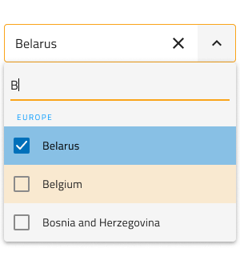
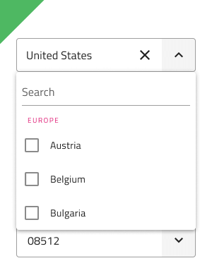
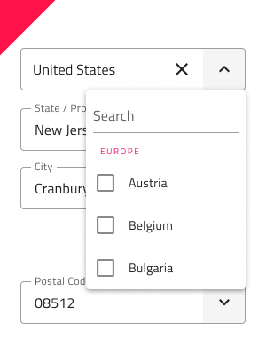

# Combo (コンボ)

Combo コンポーネントを使用して、事前定義された選択肢のリストからオプションを選択したり、独自の値を入力したりすることができます。ユーザーが下矢印アイコンをクリックすると、オプションのドロップダウン リストが表示され、オプションの 1 つを選択したり、値を検索したり、テキスト ボックスに独自の値を入力したりできます。Combo は、[Ignite UI for Angular Combobox コンポーネント](https://jp.infragistics.com/products/ignite-ui-angular/angular/components/combo.html)と視覚的に同じです。

> [!Note]
> Combo には複数選択によるコンボ `(Combo)` と [Single Select Combo (Simple Combo)](simple-combo.md) の2 つのレイアウト オプションがあります。

## Combo のデモ

Combo は 2 つのパーツに分かれます。現在の選択またはプレースホルダーを含む Input と 1 つ以上の項目を選択するために表示する Dropdown。

## Combo Input タイプ

Combo Input は線タイプ (エアリー スタイル)、境界線タイプ (単色背景でよりはっきりと表示)、より読みやすくするために鮮明な画像の上に配置する際に最適なボックス タイプから選択が可能です。Line スタイルは非推奨であるため、Figma では border と box のタイプのみを使用できます。

| Border | Box |
| ------- | ------- |
|  |  |

## 操作状態

3 つの Combo Input タイプはそれぞれ、**有効**または**無効**の状態で挿入できます。Line スタイルは非推奨であるため、Figma では border と box のタイプのみを使用でき、プロパティ パネルから無効状態に切り替えることができます。

## 状態

ユーザーが Combo とインタラクティブに操作する際に入力はさまざまな選択状態を経由します。コンテンツの代わりにプレースホルダーがある **Idle (アイドル)**、ドロップダウンが開いていて、検索欄にフォーカスがあるときの **Focused (フォーカス済み)**、ユーザーが選択を完了して次に進むと **Filled (塗りつぶし済み)**です。柔軟性が向上したことにより、Hi-Fi プロトタイプへシームレスにフローする動的なインタラクション デザインの作成が可能です。

| Idle | Focused | Filled | 
| ------- | ------- | ------- |
|  |  |  |

経験豊富なデザイナーは、ユーザー入力を制限して無効な状態を防止するために、検証スタイルを使用します。Combo Input の検証スタイルには統一感のある標準 [Input](input.md) があり、成功、警告、エラーを表示する洗練されたデザインを提供します。

| Success | Warning | Error | 
| ------- | ------- | ------- |
|  |  |  |

Sketch では状態と検証状態を `Symbol Overrides` で実現していますが、Adobe XD では `Component States` パラダイムを使用して簡単に状態を切り替えることができます。Figma では、状態の変更はプロパティ パネルで行います。

> [!Note]
> Combo Input はレイアウト オプションが 1 つしかありませんが、このオーバーライドは、標準 [Input](input.md) との一貫性を確保するために Sketch で保持されています。Figma には、単一選択タイプと複数選択タイプの両方の Combo コンポーネントで明示的に使用される `.Combo Input` と呼ばれる別の基本コンポーネントがあります。Combo Input には、**オン**/**オフ**を切り替えることができる Prefix コンテナーがあります。

## Dropdown タイプ

Combo に使用される Dropdown は、標準 [Dropdown](dropdown.md) コンポーネント同様にデスクトップやモバイルに適切なサイズがサポートされます。ドロップダウンはブール値プロパティから**オン**/**オフ**を切り替えることができ、入力に視覚的に影響を与える可能性がありますが、これは予期された動作です。

| Desktop | Mobile |
| ------- | ------- |
|  |  |

## Dropdown Search Input (ドロップダウン検索入力)

Figma と Sketch では、Dropdown には、標準の [Input](input.md) と同様に、状態の選択とレイアウトのオプションが付属する Search Input が含まれています。

## Dropdown Items (ドロップダウン項目)

Combo に使用される Dropdown は、ヘッダーと複数選択項目の 2 種類の項目をサポートします。ヘッダーを介して、項目をグループに体系化できます。Figma では、Dropdown は、1 つまたは複数の項目がレイヤー パネルから非表示になると、レイアウトを調整する自動レイアウト オプションを利用します。Sketch で Dropdown はスマート レイアウトを使用しており、1 つ以上の項目が ~No Symbol に設定されている場合に応じて調整できます。Adobe XD では、不要なものを削除し、Stack を使用してレイアウトを調整します。

## Dropdown Item の状態

Combo 内のドロップダウン項目は、**Idle (アイドル)**、**Hover (ホバー)**、**Focused (フォーカス済み)** の 3 つの異なる状態をサポートします。**Disabled (無効)** および **Selected (選択済み)** の状態はブール値プロパティからオンとオフを切り替えることができ、ドロップダウンのすべての状態に適用されます。

| Idle | Hover | Focused | Disabled |
| ---- | ----- | ------- | -------- |
|  |  |  |  |
| Selected |  |  |  |  |

## スタイル設定

Combo は入力とドロップダウン部分でスタイルの組み合わせに柔軟性があります。入力テキスト要素の色と最終的な行のスタイルと色にはオプションがあります。Dropdown の場合、背景色を変更するか、Search Input や背景色とテキスト色の項目など、Combo Dropdown の項目に関連するさまざまなオプションを使用できます。

## 使用方法

Combo を使用する際に入力とドロップダウンは同じ幅で左右の境界線が一致する必要があります。Combo がフォーカスされたときのドロップダウンの表示は、Combo が表示をトリガーしたあとに常にコンテンツの上に表示する必要があります。Combo は、コンテンツを展開パネルのようにはプッシュしません。

| 良い例                                                                           |悪い例                                                                            |
| ---------------------------------------------------------------------------- | -------------------------------------------------------------------------------- |
|  |  |
|  |  |

## その他のリソース

関連トピック:

- [Dropdown](dropdown.md)
- [Form パターン](../patterns/form.md)
- [Input](input.md)
- [Simple Combo](simple-combo.md)
  

コミュニティに参加して新しいアイデアをご提案ください。
