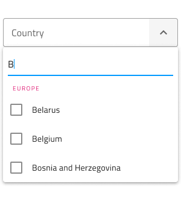
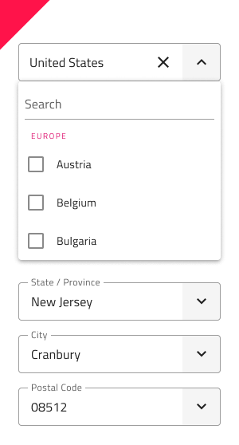

# Combo (コンボ)

Combo コンポーネントを使用して、事前定義された選択肢のリストからオプションを選択したり、独自の値を入力したりすることができます。ユーザーがドロップダウン矢印をクリックすると選択肢のドロップダウン リストが表示されるのでその1 つを選択するか、テキスト ボックスに独自の値を入力することができます。Combo は、[Ignite UI for Angular Combobox コンポーネント](https://jp.infragistics.com/products/ignite-ui-angular/angular/components/combo.html)と視覚的に同じです。

## Combo のデモ

Combo は 2 つのパーツに分かれます。現在の選択を含む入力と 1 つ以上の項目を選択するために表示するドロップダウン。

## Combo Input タイプ

Combo Input は線タイプ (エアリー スタイル)、境界線タイプ (単色背景でよりはっきりと表示)、より読みやすくするために鮮明な画像の上に配置する際に最適なボックス タイプから選択が可能です。	Line スタイルは非推奨であるため、Figma では border と box のタイプのみを使用できます。

`border`

`box`

## 操作状態

3 つの Combo Input タイプはそれぞれ、有効または無効の状態で挿入できます。Line スタイルは非推奨であるため、Figma では border と box のタイプのみを使用でき、プロパティ パネルから無効状態に切り替えることができます。

## 状態

ユーザーが Combo とインタラクティブに操作する際に入力はさまざまな選択状態を経由します。コンテンツの代わりにプレースホルダーがある **Idle (アイドル状態)**、ドロップダウンが開いているときの **Focused (フォーカス状態)**、ユーザーが選択を完了して次に進むときの **Filled (塗りつぶし状態)**。柔軟性が向上したことにより、Hi-Fi プロトタイプへシームレスにフローする動的なインタラクション デザインの作成が可能です。

`idle`

`focused`

`filled`

経験豊富なデザイナーは、ユーザー入力を制限して無効な状態を防止するために、検証スタイルを使用します。Combo の検証スタイルには統一感のある標準 [Input](input.md) があり、success (成功)、warning (警告)、error (エラー) を表示する洗練されたデザインを提供します。

`success`

`warn`

`error`

Sketch では状態と検証状態を `Symbol Overrides` で実現していますが、Adobe XD では `Component States` パラダイムを使用して簡単に状態を切り替えることができます。	Figma では、状態の変更はプロパティ パネルで行います。

> [!Note]
> Combo 入力はレイアウト オプションが 1 つしかありませんが、このオーバーライドは、標準 [Input](input.md) との一貫性を確保するために Sketch で保持されています。一方、Figma では、Combo コンポーネントで明示的に使用される `.Combo Input` と呼ばれる別の基本コンポーネントがあります。

## Drop Down タイプ

Combo に使用される Drop Down は、標準 [Dropdown](dropdown.md) コンポーネント同様にデスクトップやモバイルに適切なサイズがサポートされます。

`desktop`

`mobile`

## Drop Down Search Input (検索入力)

Sketch では、ドロップダウンには、標準の [Input](input.md) と同様に、状態の選択とレイアウトのオプションが付属する Search Input が含まれています。

## Drop Down Items (項目)

Combo に使用されるドロップダウンは、ヘッダーと複数選択項目の 2 種類の項目をサポートします。ヘッダーを介して、項目をグループに体系化できます。Figma では、Drop Down は、1 つまたは複数の項目がレイヤー パネルから非表示になると、レイアウトを調整する自動レイアウト オプションを利用します。Sketch では、Bottom Navigation は、スマート レイアウトを使用しており、1 つ以上の項目が ~No Symbol に設定されていても、それに対応して調整できます。Adobe XD では、不要なものを削除し、Stack を使用してレイアウトを調整します。

## Drop Down Item の状態

Combo 内のドロップダウン項目は、6 つの異なる状態をサポートしています: **Idle (アイドル)**、**Idle & Disabled (アイドルおよび無効)**、**Disabled (無効)**、**Selected (選択済み)**、**Selected & Focused (選択済みおよびフォーカス済み)**、**Focused (フォーカス済み)** です。

`idle`

`idle & disabled`

`disabled`

`selected`

`selected & focused`

`focused`

## スタイル設定

Combo は入力とドロップダウン部分でスタイルの組み合わせに柔軟性があります。入力テキスト要素の色と下線のスタイルと色のオプションがあります。Drop Down の場合、背景色を変更するか、検索入力や背景色とテキスト色の項目など、Combo Drop Down の項目に関連するさまざまなオプションを使用できます。

## 使用方法

Combo を使用する際に入力とドロップダウンは同じ幅で左右の境界線が一致する必要があります。Combo がフォーカスされたときのドロップダウンの表示は、Combo が表示をトリガーしたあとに常にコンテンツの上に表示する必要があります。Combo は、コンテンツを展開パネルのようにはプッシュしません。

| 良い例                                                                           |悪い例                                                                            |
| ---------------------------------------------------------------------------- | -------------------------------------------------------------------------------- |
|  |  |
|  |  |

## その他のリソース

関連トピック:

- [Dropdown](dropdown.md)
- [Form パターン](../patterns/form.md)
- [Input](input.md)
  

コミュニティに参加して新しいアイデアをご提案ください。
