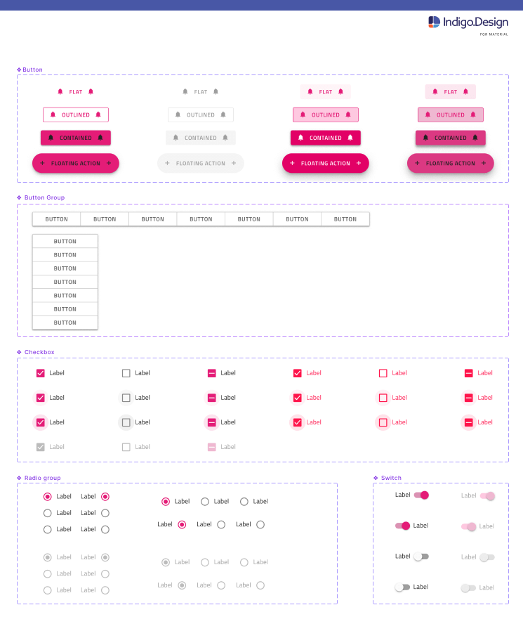

# コンポーネントの概要

**Indigo.Design システム**は、Ignite UI for Angular コントロールにマップする 60 以上の UI コンポーネントでデザイン ワークフローを強化します。ほとんどのコンポーネントはレスポンシブ Web デザインと開発用に最適化されており、Figma の Auto Layout およびサイズ変更ルールを通じてさまざまなテンプレート機能を提供します。これらすべてがアプリケーションのデザインと開発を合理化し、ライブラリを使用して多種多様なユーザー インターフェイス シナリオを作成し、コード生成を通じて、Ignite UI for Angular コードとして利用できるようにします。

> [!WARNING]
> **Indigo.Design システム** ライブラリのコンポーネントを適切に使用し、潜在的な問題を回避するには、Figma のフレームに `Base Components` を配置しないことを推奨します。
> これらの要素にはコンポーネント状態がなく、完全なコンポーネントとは見なされません。

## Figma

Figma ライブラリ内には `🧩 Components` という名前のページがあり、その下にキットに含まれるすべてのコンポーネントのリストがあります。各コンポーネントにはページがあり、そこに関連するすべての `Base Components` が配置されます。デザイン ファイルでライブラリを使用できるようにすると、サイドバーからそのアセットに簡単にアクセスし、左側のサイドバーの [Assets] パネルからコンポーネントをキャンバスにドラッグできるようになります。ワークスペースにコンポーネントを配置して選択すると、右側のサイドバーにそのコンポーネントで使用可能なプロパティが表示され、そこからインスタンスを直接交換することもできます。以下は、さまざまなタイプの [Button](button.md)、[Button Group](button-group.md)、および [Checkbox](checkbox.md)、[Switch](switch.md)、[Radio Group](radio-group.md) などのフォーム要素などのコンポーネントを示しています。

> [!WARNING]
> Figma ライブラリからコンポーネントをデタッチすると、デザイン システムの後続のバージョンからの更新を自動的に適用できなくなり、コンポーネントのコード生成機能に影響を与える可能性があります。コード生成サービスは、コンポーネントの状態、テンプレート、およびその他のプロパティの `🚫 metadata` 記述を含む、特別に指定されたメタデータ レイヤーに依存します。すべてのコンポーネントには `🚫 componentVersion` というバージョンを含む追加のレイヤーが配置されており、コード生成の成功に役立ちます。

すべての **Indigo.Design システム** コンポーネントは、ユーザー インターフェイスのテーマ設定やブランディングを行うための複雑なメカニズムを活用できるように、リジッドな[スタイリングの基礎](../style/styling-overview.md)の上に構築されています。

## その他のリソース

関連トピック:

- [スタイル設定](../style/styling-overview.md)
- [パターン](../patterns/patterns-overview.md)
  

コミュニティに参加して新しいアイデアをご提案ください。
