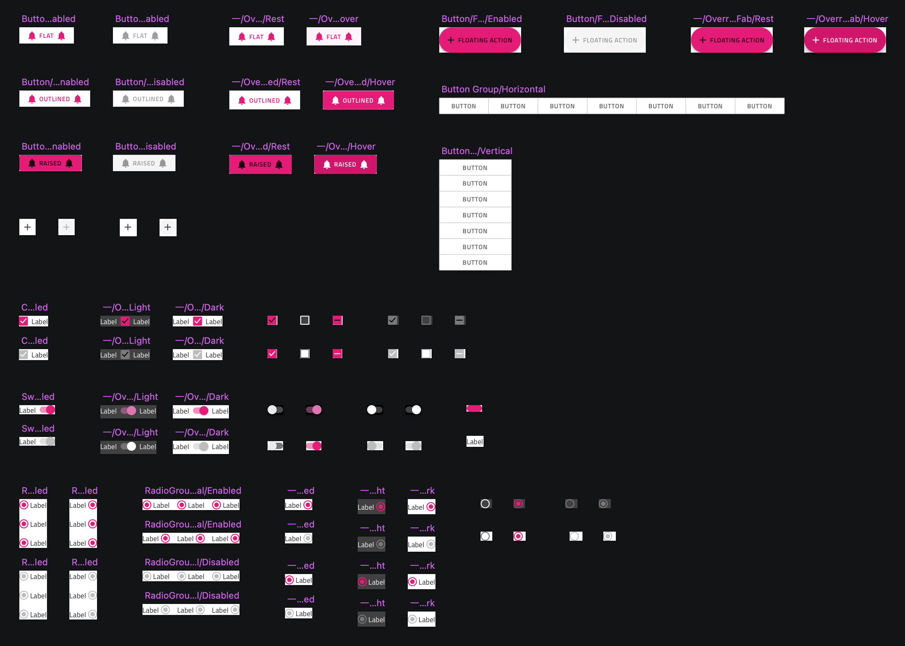

# コンポーネントの概要

**Indigo.Design システム**は、Ignite UI for Angular コントロールにマップする 60 以上の UI コンポーネントでデザイン ワークフローを強化します。各コンポーネントはレスポンシブ Web 開発向けに最適化されており、ライブラリで設定されたスマート レイアウトとサイズ変更ルールによってさまざまなテンプレート機能を提供します。さらに、動的なエクスペリエンスをデザインするときに選択できるライト/ダーク モードおよびさまざまな操作状態を追加しました。これにより、アプリケーションの設計と開発が簡素化され、Sketch のライブラリで作成されたユーザー インターフェイスを Angular でビルドできます (Ignite UI を介して)。 

Sketch ライブラリには、関連するすべてのコンポーネントとシンボルを含む `🧩 Components` ページがあります。以下は、[ボタン](button.md)、[ボタン グループ](button-group.md)、および[チェックボックス](checkbox.md)、[スイッチ](switch.md)、[ラジオ グループ](radio-group.md)などのフォーム要素の一部を示します。

すべての **Indigo.Design システム** コンポーネントは、ユーザー インターフェイスのテーマ設定やブランディングを行うための複雑なメカニズムを活用できるように、リジッドな[スタイリングの基礎](../styling/styling-overview.md)の上に構築されています。

> [!WARNING]
> ライブラリからコンポーネント インスタンスのリンクを解除すると、デザイン システムの後続バージョンからの更新を自動的に適用できなくなり、コンポーネントのコード生成機能に影響する場合があります。コード生成サービスは、コンポーネントの状態、テンプレート、およびその他のプロパティのメタデータ記述を含む、特別に指定された `🚫 metadata` レイヤーに依存します。

## その他のリソース

関連トピック:

- [スタイル設定](../styling/styling-overview.md)
- [パターン](../patterns/patterns-overview.md)
  

コミュニティに参加して新しいアイデアをご提案ください。
