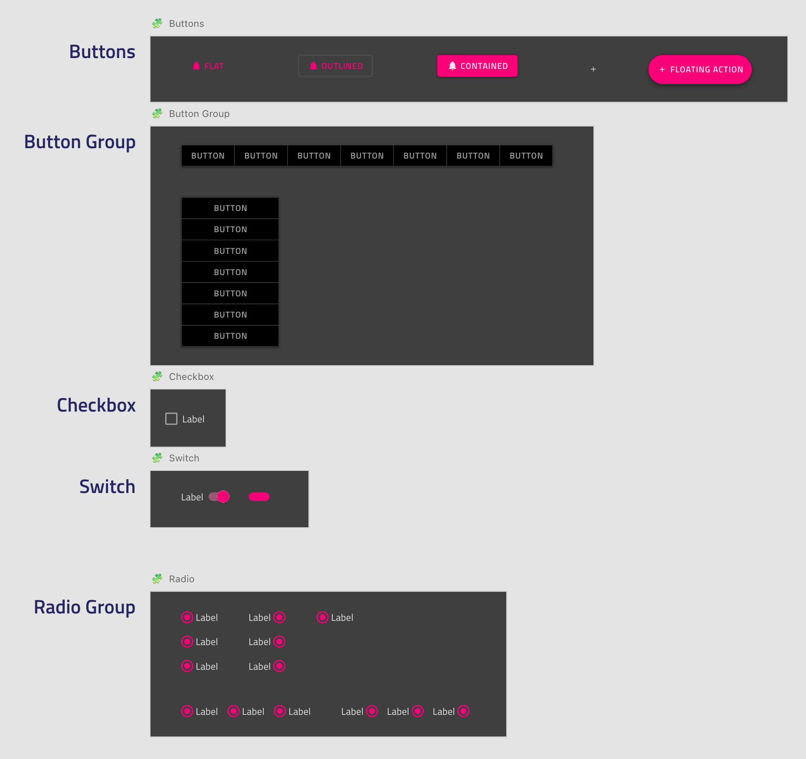

# コンポーネントの概要

**Indigo.Design システム**は、Ignite UI for Angular コントロールにマップする 60 以上の UI コンポーネントでデザイン ワークフローを強化します。各コンポーネントは、レスポンシブ Web デザインと開発用に最適化されており、Sketch で設定されたスマート レイアウトとサイズ変更ルールを通じてさまざまなテンプレート機能を提供します。Adobe XD では、Stacks と Repeat Grids を使用してこれを拡張しましたが、インタラクティブ エクスペリエンスをデザインするときに選択できるライト/ダーク モードとさまざまなインタラクション状態も追加しました。これらすべてがアプリケーションのデザインと開発を合理化し、ライブラリを使用して多種多様なユーザー インターフェイス シナリオを作成し、コード生成を通じて、Ignite UI for Angular コードとして利用できるようにします。

> [!WARNING]
> Symbols and components designated as `_Overrides` in Sketch and Adobe XD libraries must not be inserted on artboards as they provide component states and do not represent a complete component by itself.

Sketch ライブラリには、関連するすべてのコンポーネントとシンボルを含む `🧩 Components` ページがあります。右側のパネルの [Override] セクションから [Symbol] インスタンスを選択すると、内部のコンテンツを変更できます。たとえば、有効/無効の状態、ライト/ダーク バリアント、アイコン、カラーなどです。以下は、さまざまなタイプの [Button](button.md)、[Button Group](button-group.md)、および [Checkbox](checkbox.md)、[Switch](switch.md)、[Radio Group](radio-group.md) などのフォーム要素などのコンポーネントとシンボルの一部を示しています。

Adobe XD ライブラリでは、中央の列に `🧩 Components` があります。ここでは、コンポーネントのさまざまな状態を右側のパネルから切り替えることができます。また、`Stack` と `Padding` を使用して、要素を垂直または水平に配置および分散し、それらの位置を変更しました。ネストされたコンポーネントを別のコンポーネントと交換する場合は、`Libraries` パネルからドラッグして、現在のコンポーネントの上にドロップするだけで置き換えることができます。また、Grid などの一部のコンポーネントは、構成を高速化するために `Repeat Grid` を使用しています。

> [!WARNING]
> Detaching a component from the Sketch library makes it impossible to automatically apply updates from subsequent versions of the Design System and may impact the code generation capability of the component. The code generation services rely on specially designated `🚫 metadata` layers, containing metadata descriptions of the state, template and other properties of the component.
>
> Ungrouping a component or pattern from the Adobe XD library has even worse implications because it turns all nested components into groups and breaks the code generation service for the component as it cannot trace correctly its structure. You can make any state, layout and styling adjustment in Adobe XD without ungrouping a component so we kindly advise you to keep the entirety of the components on your artboards.

すべての **Indigo.Design システム** コンポーネントは、ユーザー インターフェイスのテーマ設定やブランディングを行うための複雑なメカニズムを活用できるように、リジッドな[スタイリングの基礎](../style/styling-overview.md)の上に構築されています。

> [!WARNING]
> When changing an icon glyph with another one by dragging it from the `Libraries` panel in Adobe XD, sometimes its layer name will change from `🔣 Icon` to the symbol name `_Overrides/~`. When this happens you must rename it back to the original layer name before the element got swapped to assure successful code generation.

## その他のリソース

関連トピック:

- [スタイル設定](../style/styling-overview.md)
- [パターン](../patterns/patterns-overview.md)
  

コミュニティに参加して新しいアイデアをご提案ください。
