# Date Picker (日付ピッカー)

Date Picker コンポーネントは、日付を視覚的に表現し、フォームへの表示およびドロップダウンまたはダイアログから選択するための適切な手段を提供します。Date Picker は、[Ignite UI for Angular Date Picker コンポーネント](https://jp.infragistics.com/products/ignite-ui-angular/angular/components/date_picker.html)と視覚的に同じものです。

## Date Picker のデモ

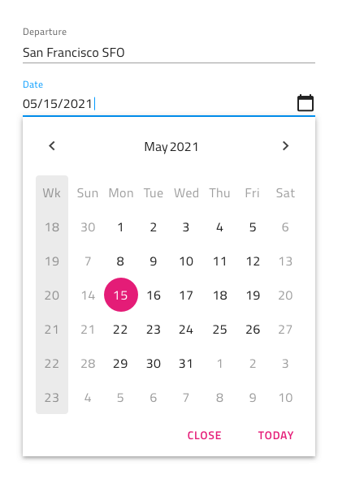

## Date Picker Input (日付ピッカー入力)

フォームに Date Picker Input を挿入して、日付を選択するためのフィールドを示すことができます。Enabled および Disabled の操作状態、およびユーザーの操作時に表示されるダイアログとドロップダウンのバリアントをサポートします。

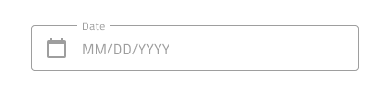

## Picker レイアウト

Date Picker は、Horizontal と Vertical 方向の Dialog レイアウト、およびドロップダウン レイアウトをサポートし、日付を選択するさまざまなモードを容易にします。Dialog レイアウトには、オーバーライドを ~No Symbol に設定することで非表示にできる Header が付属していますが、その他にも Dialog レイアウトが投影する影により、Drop-down レイアウトと区別できます。

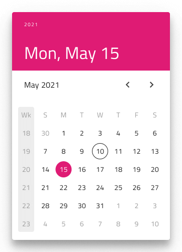
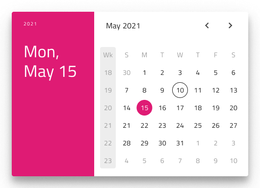
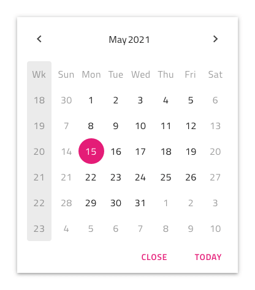

## 週のはじめ

週の開始日は、Date Picker の挿入時にオプションとして最も一般的なシナリオである日曜日と月曜日から選択できます。

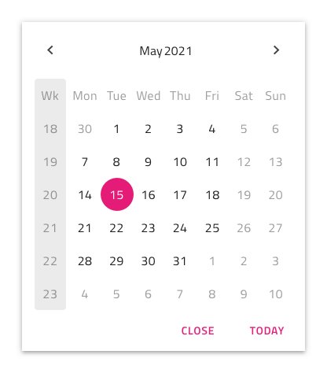

## Week Numbers (週番号)

Date Picker には、Calendar と同じように Week Numbers のサポートが組み込まれています。UI のこの部分を表示したくない場合は、Week Numbers のオーバーライドを ~No Symbol に設定するだけです。

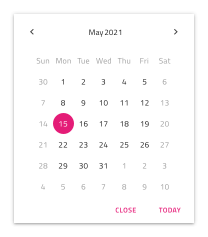

## 選択

Calendar と同様に、Date Picker では 3 つの選択モードから選択できます: ユーザーが 1 つの日付のみを選択できるように制限する  **Single Day**、ランダムな複数の日付を選択できる Multiple Days、および開始から終了までのすべての日付を選択する手段を提供する Range。

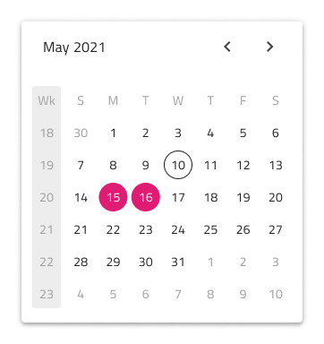
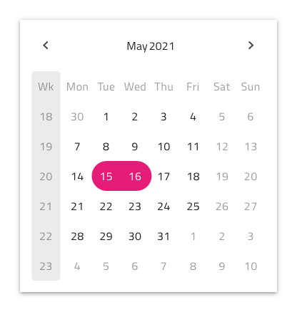

## ボタン

Drop-down Date Picker には 2 つのボタンがあります: 1 つは現在の選択を保持して閉じるためのもので、もう 1 つは今日に移動するためのものです。Button 領域はテンプレート化可能であり、たとえば、オーバーライドを ~No Symbol に設定してボタンを非表示にしたり、別のアクションを割り当てることができます。Dialog Date Picker には、日付を選択するとダイアログが自動的に閉じるため、デフォルトではボタンがありません。

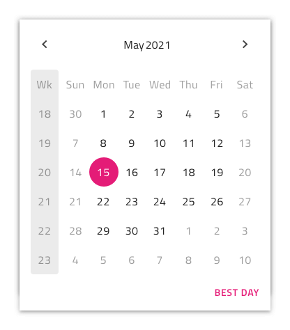

## スタイル設定

Time Picker は、さまざまなオプションを通じてヘッダー背景、タイトル色、選択した時間、分、AM/PM のテキストの色を柔軟にスタイル設定できます。Cancel と OK のボタンは、[Flat Buttons](button.md) で状況に応じたスタイル設定が可能です。

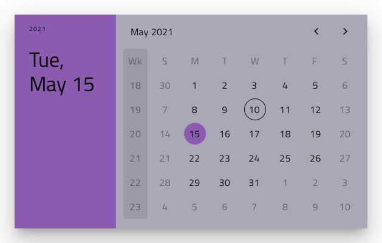

## 使用方法

Horizontal と Vertical Time Picker をダイアログで表示し、ダイアログ以外の UI は暗くなります。

| 良い例                                                                                     | 悪い例                                                                                      |
| -------------------------------------------------------------------------------------- | ------------------------------------------------------------------------------------------ |
| 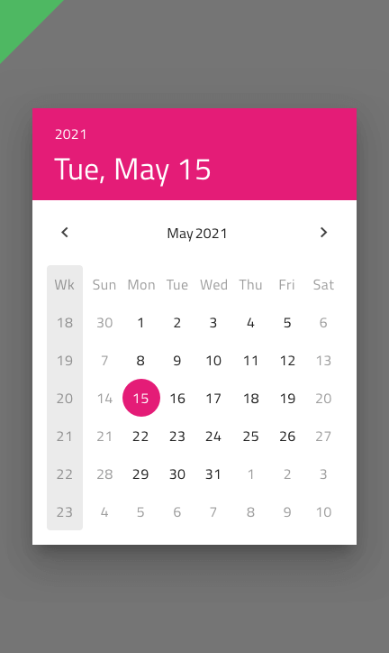 | 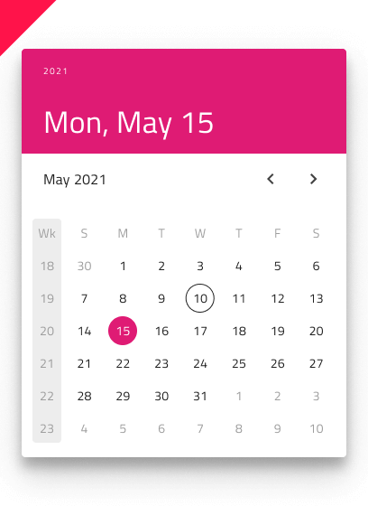 |
| 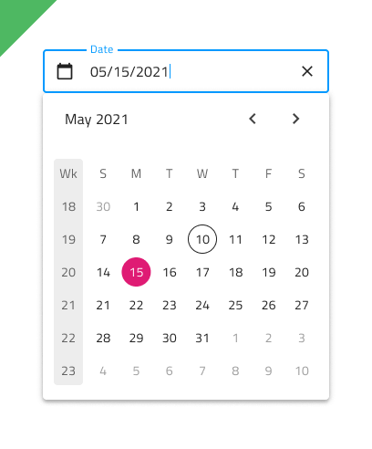 | 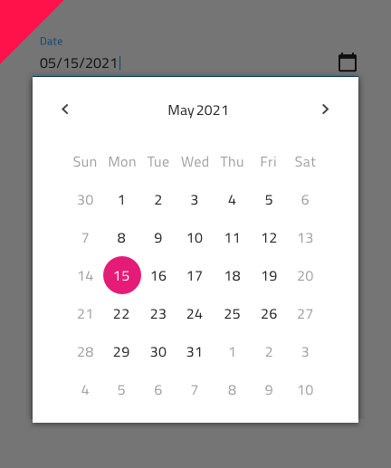 |

## その他のリソース

関連トピック:

- [Calendar](calendar.md)
- [Input](input.md)
- [Time Picker](time-picker.md)
- [Form パターン](../patterns/form.md)
  

コミュニティに参加して新しいアイデアをご提案ください。

