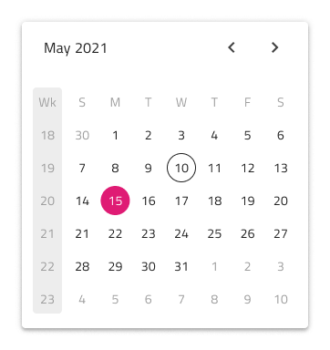
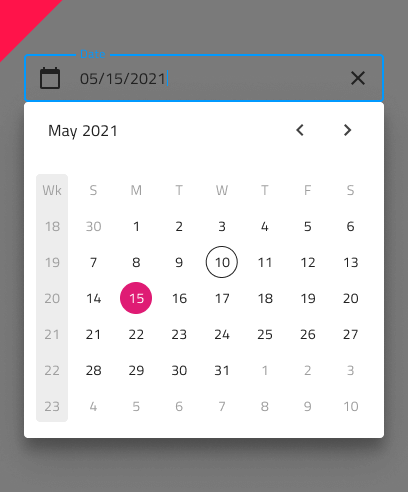

# Date Picker (日付ピッカー)

Date Picker コンポーネントは、日付を視覚的に表現し、フォームへの表示およびドロップダウンまたはダイアログから選択するための適切な手段を提供します。Date Picker は、[Ignite UI for Angular Date Picker コンポーネント](https://jp.infragistics.com/products/ignite-ui-angular/angular/components/date_picker.html)と視覚的に同じものです。

## Date Picker のデモ

## Date Picker タイプ

Figma では、プロパティ パネルの `Type` プロパティで dialog または dropdown の Date Picker を選択できます。

## Date Picker サイズ

すべての Date Picker タイプは、次の 3 つのサイズで使用できます。

- Large (大)
- Medium (中)
- Small (小)

## Date Picker Input (日付ピッカー入力)

フォームに Date Picker Input を挿入して、日付を選択するためのフィールドを示すことができます。Dialog と Dropdown のバリエーションがあり、ユーザーの操作に応じて表示されます。

## Date Picker Input タイプ

Figma では、ユーザーは 2 つのタイプの Date Picker Input を選択できます。1 つは無地の背景上でより構造的に見える border スタイル、もう 1 つは鮮やかな画像の上に配置した際に内容の可読性を高めるのに最適な box スタイルです。

## Date Picker Input サイズ

すべての Date Picker 入力タイプには、Date Picker コンポーネントの対応するサイズに合わせて 3 つのサイズがあります。

- Large (大)
- Medium (中)
- Small (小)

## Date Picker Input 状態

Date Picker の入力は 7 つのインタラクション状態 (**Idle**、**Idle & Hover**、**Idle & Disabled**、**Filled**、**Filled & Hover**、**Filled & Disabled**、**Focused**) と、3 つのバリデーション状態 (**Success**、**Warn**、**Error**) をサポートします。

## Date Picker レイアウト

Date Picker は、水平および垂直方向の Dialog レイアウトおよび Dropdown レイアウトをサポートしており、さまざまなシャドウを表示して互いに区別しやすくすることで、さまざまな日付の選択モードを容易にします。Dialog レイアウトにはヘッダーが付属していることに注意してください。ブール値の `Header` プロパティをオフにすることで Figma でヘッダーを非表示にすることができ、追加された自動レイアウトのおかげでレイアウトはそれに応じて自動的に調整されます。

Figma では、`Action Buttons` ブール値プロパティを有効にすることで、Date Picker の下部にアクション ボタンを表示できます。

## マルチビューのバリエーション

Date Picker には、2 か月を並べて表示する Multiview オプションが含まれています。Figma では、`Multiview` ブール値プロパティを使用してこれを有効にし、`Orientation` プロパティを使用して水平方向または垂直方向を選択できます。

## コンテンツ

Figma では `View` プロパティで Day、Month、Year のビューを切り替えて、主要な日付区分を表示しやすくできます。

## 週のはじめ

週の最初の曜日として、最も一般的な 2 つのシナリオ (日曜日と月曜日) をサポートしています。Figma では、`Week Start` プロパティから週の開始を選択できます。

## Week Numbers (週番号)

Date Picker には、Calendar と同じように週番号のサポートが組み込まれています。UI のこの部分を表示したくない場合は、Figma のブール値の `Week Numbers` プロパティをオフにするだけで、追加された自動レイアウトのおかげでレイアウトが自動的に調整されます。

## 選択

Calendar と同様に、Date Picker では 3 つの選択モードから選択できます: ユーザーが 1 つの日付のみを選択できるように制限する **Single Day**、ランダムな複数の日付を選択できる **Multiple Days**、および開始から終了までのすべての日付を選択する手段を提供する **Range**。

## スタイル設定

Date Picker は、ヘッダーの背景やタイトルの色、選択日や現在の日付・月・年のテキスト色など、さまざまなスタイリングの選択肢を備えています。

## 使用方法

Dialog タイプの Date Picker を使用する場合のみ、UI の他の部分を暗くすることが推奨されます。

| 良い例                                                                                     | 悪い例                                                                                      |
| -------------------------------------------------------------------------------------- | ------------------------------------------------------------------------------------------ |
|  |  |
|  |  |

## その他のリソース

関連トピック:

- [Calendar](calendar.md)
- [Input](input.md)
- [Time Picker](time-picker.md)
- [Form パターン](../patterns/form.md)
  

コミュニティに参加して新しいアイデアをご提案ください。
