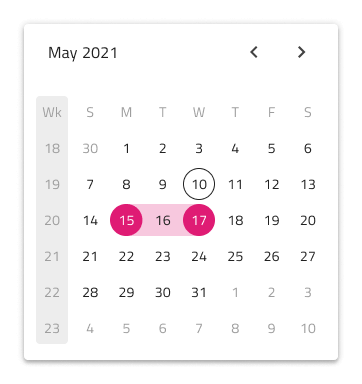

# Date Picker (日付ピッカー)

Date Picker コンポーネントは、日付を視覚的に表現し、フォームへの表示およびドロップダウンまたはダイアログから選択するための適切な手段を提供します。Date Picker は、[Ignite UI for Angular Date Picker コンポーネント](https://jp.infragistics.com/products/ignite-ui-angular/angular/components/date_picker.html)と視覚的に同じものです。

## Date Picker のデモ

## Date Picker Input (日付ピッカー入力)

フォームに Date Picker Input を挿入して、日付を選択するためのフィールドを示すことができます。Enabled および Disabled の操作状態、およびユーザーの操作時に表示されるダイアログとドロップダウンのバリアントをサポートします。

## Picker レイアウト

Date Picker は、水平および垂直方向の Dialog レイアウトおよび Dropdown レイアウトをサポートしており、さまざまなシャドウを表示して互いに区別しやすくすることで、さまざまな日付の選択モードを容易にします。Dialog レイアウトにはヘッダーが付属していることに注意してください。ブール値の `Header` プロパティをオフにすることで Figma でヘッダーを非表示にすることができ、追加された自動レイアウトのおかげでレイアウトはそれに応じて自動的に調整されます。Sketch では、Header のオーバーライドを ~No Symbol に設定することでこれを実現でき、スマート レイアウトを使用することですべてがそれに応じて調整されます。Adobe XD では、ヘッダー レイヤーを削除する必要があり、Stack を使用してレイアウトが調整されます。

Figma では、`Action Buttons` ブール値プロパティを有効にすることで、Date Picker の下部にアクション ボタンを表示できます。

## マルチビューのバリエーション

Date Picker には、2 か月を並べて表示する Multiview オプションが含まれています。Figma では、`Multiview` ブール値プロパティを使用してこれを有効にし、`Orientation` プロパティを使用して水平方向または垂直方向を選択できます。Sketch と Adobe XD では、水平方向のマルチビューのみが使用可能であり、コンポーネントを追加するときに方向とビューを選択する必要があります。

## 週のはじめ

週の最初の曜日として、最も一般的な 2 つのシナリオ (日曜日と月曜日) をサポートしています。Figma では、`Week Start` プロパティから週の開始を選択できます。Sketch および Adobe XD では、日付ピッカーを挿入するときにオプションとして開始日を選択する必要があります。

## Week Numbers (週番号)

Date Picker には、Calendar と同じように週番号のサポートが組み込まれています。 UI のこの部分を表示したくない場合は、Figma のブール値の `Week Numbers` プロパティをオフにするだけで、追加された自動レイアウトのおかげでレイアウトが自動的に調整されます。 Sketch では、Week Numbers オーバーライドを ~No Symbol に設定することでこれを実現でき、スマート レイアウトを使用することで、すべてがそれに応じて調整されます。Adobe XD で Week Numbers レイヤーを削除して同じことを実行し、そこで使用される Stack が同様の方法でレイアウトを調整します。

## 選択

Calendar と同様に、Date Picker では 3 つの選択モードから選択できます: ユーザーが 1 つの日付のみを選択できるように制限する **Single Day**、ランダムな複数の日付を選択できる **Multiple Days**、および開始から終了までのすべての日付を選択する手段を提供する **Range**。

## スタイル設定

Date Picker は、さまざまなオプションでヘッダー背景、タイトル色、選択した日付や現在の日付などのテキストの色の制御などスタイル設定に柔軟性があります。

## 使用方法

Horizontal と Vertical Dialog Date Picker をダイアログで表示し、ダイアログ以外の UI は暗くなります。

| 良い例                                                                                     | 悪い例                                                                                      |
| -------------------------------------------------------------------------------------- | ------------------------------------------------------------------------------------------ |
|  |  |
|  |  |

## その他のリソース

関連トピック:

- [Calendar](calendar.md)
- [Input](input.md)
- [Time Picker](time-picker.md)
- [Form パターン](../patterns/form.md)
  

コミュニティに参加して新しいアイデアをご提案ください。
