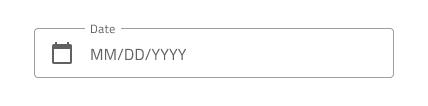

# Date Picker (日付ピッカー)

Date Picker コンポーネントは、日付を視覚的に表現し、フォームへの表示およびドロップダウンまたはダイアログから選択するための適切な手段を提供します。Date Picker は、[Ignite UI for Angular Date Picker コンポーネント](https://www.infragistics.com/products/ignite-ui-angular/angular/components/date_picker.html)と視覚的に同じものです。

## Date Picker デモ

## Date Picker の入力

フォームに Date Picker 入力を挿入して、日付を選択するためのフィールドを示すことができます。有効および無効の操作状態、およびユーザーの操作時に表示されるダイアログとドロップダウンのバリアントをサポートします。

## Picker レイアウト

Date Picker は、水平方向と垂直方向のダイアログ レイアウト、およびドロップダウン レイアウトをサポートし、日付を選択するさまざまなモードを容易にします。ダイアログ レイアウトには、オーバーライドを 〜No Symbol に設定することで非表示にできるヘッダーが付属していますが、その他にもダイアログ レイアウトが投影する影により、ドロップダウン レイアウトと区別できます。

## 週のはじめ

週の開始日は、Date Picker の挿入時にオプションとして最も一般的なシナリオである日曜日と月曜日から選択できます。

## 週番号

Date Picker には、Calendar と同じように週番号のサポートが組み込まれています。UI のこの部分を表示したくない場合は、週番号のオーバーライドを 〜NoSymbol に設定するだけです。

## 選択

Calendar と同様に、Date Picker では 3 つの選択モードから選択できます: ユーザーが 1 つの日付のみを選択できるように制限する  **Single Day**、ランダムな複数の日付を選択できる Multiple Days、および開始から終了までのすべての日付を選択する手段を提供する Range。

## ボタン

ドロップダウン Date Picker には 2 つのボタンがあります: 1 つは現在の選択を保持して閉じるためのもので、もう 1 つは今日に移動するためのものです。ボタン領域はテンプレート化可能であり、たとえば、オーバーライドを 〜No Symbol に設定してボタンを非表示にしたり、別のアクションを割り当てることができます。ダイアログ Date Picker には、日付を選択するとダイアログが自動的に閉じるため、デフォルトではボタンがありません。

## スタイル設定

Time Picker は、さまざまなオーバーライドでヘッダー背景、タイトル色、選択した時間、分、AM/PM のテキストの色の制御などスタイル設定に柔軟性があります。Cancel と OK のボタンは、Flat Buttons で状況に応じたスタイル設定が可能です。

## 使用方法

水平と垂直の時間選択をダイアログで表示し、ダイアログ以外の UI は暗くなります。

| 良い例                                                                                     | 悪い例                                                                                      |
| -------------------------------------------------------------------------------------- | ------------------------------------------------------------------------------------------ |
|  |  |
|  |  |

## その他のリソース

関連トピック:

- [Calendar](calendar.md)
- [Input](input.md)
- [Time Picker](time-picker.md)
- [Form パターン](../patterns/form.md)
  

コミュニティに参加して新しいアイデアをご提案ください。

