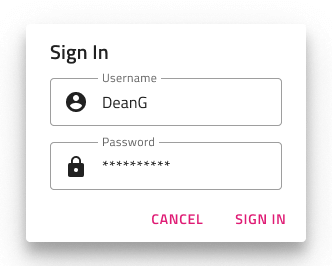
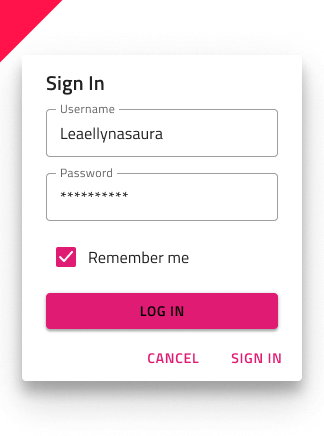

# Dialog (ダイアログ)

Dialog コンポーネント シンボルは、メッセージや警告をユーザーに表示、あるいはログインなど直ちに操作が必要なフォームを表示します。Dialog をモーダルに表示してユーザーが完了または閉じるまで次に進めないようにします。Dialog は、[Ignite UI for Angular Dialog Window コンポーネント](https://jp.infragistics.com/products/ignite-ui-angular/angular/components/dialog.html)と視覚的に同じものです。

## Dialog のデモ

## タイプ

Dialog 確認ボタンのみの警告を表示します。キャンセルや確認のメッセージ、あるいは直ちに対応が必要なユーザー ログインなどのコンテナーとして使用します。Button 領域はテンプレート化可能で、ボタンなどを調整できます。Sketch で非表示にするには、メイン オーバーライドを ~No Symbol に設定する必要があります。スマート レイアウトのおかげで領域はそれに応じて調整されます。Adobe XD で同様の操作を行うには、不要なボタンを削除します。Stack は領域レイアウトを調整しますが、Sketch とは異なり別のボタンを挿入することもできます。In Figma, in order to hide one of the two action buttons, you need to do that from the layers panel and the auto layout will adjust the area automatically.

## スタイル設定

Dialog には、タイトルとメッセージのさまざまなオプション、[Button](button.md) コンポーネントが提供するすべてのスタイリング オプションを備えた下部のボタン、および背景とエレベーションによるスタイリングの柔軟性があります。

## 使用方法

カスタム Dialog をデザインする場合、本体セクションに操作のためのボタンは配置せずに既存ダイアログ ボタンを使用します。

| 良い例                            | 悪い例                           |
| ----------------------------- | ------------------------------- |
|  |  |

## その他のリソース

関連トピック:

- [Button](button.md)
  

コミュニティに参加して新しいアイデアをご提案ください。
