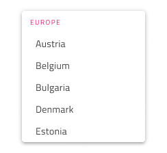
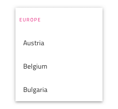
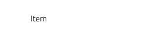
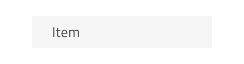
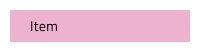
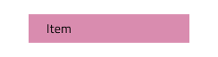
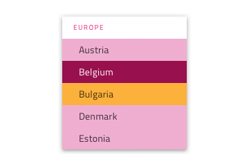
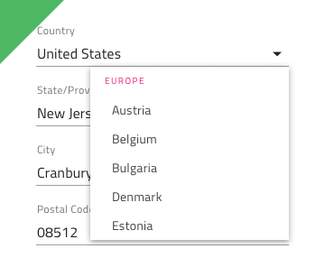
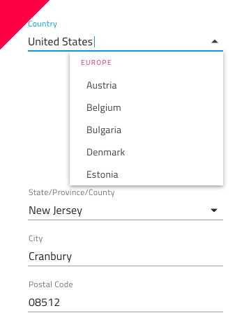

# Dropdown (ドロップダウン)

Dropdown コンポーネントでは、ユーザーがスクロール可能なリストでユーザー インタラクションに応じて表示されるコレクションから項目を選択できます。一度に 1 項目のみ選択でき、複数選択を許容する場合は [Combo](combo.md) を使用します。ドロップダウン は、[Ignite UI for Angular Dropdown コンポーネント](https://jp.infragistics.com/products/ignite-ui-angular/angular/components/drop_down.html)と視覚的に同じです。

## Dropdown デモ

## タイプ

Dropdown は、デスクトップとモバイルで使用時に適切なサイズで提供されます。

## 項目

Dropdown は、項目ヘッダーと項目の 2 つのタイプをサポートします。ヘッダーでグループの他の項目を体系化できます。

## 項目の状態

Dropdown 項目は、5 つの状態をサポートします。disabled, **idle**、focused、selected、focused&selected。

## スタイル設定

Dropdown は、背景色を制御するオーバーライドによるスタイル設定、項目やヘッダー背景、テキスト色を含む項目に関連するさなざまなオーバーライドに高い柔軟性があります。

## 使用方法

Dropdown 使用時は、表示をトリガーする項目に従ってコンテンツの最上部に表示する必要があります。良い例pdowns は、アコーディオンのようにはコンテンツはプッシュしません。

| 良い例                                                                                 |悪い例                                                                                  |
| ---------------------------------------------------------------------------------- | -------------------------------------------------------------------------------------- |
| | |

## コードの生成

> [!WARNING]
> デザインの Dropdown インスタンスで `Detach from Symbol` をトリガーすると、ほとんどの場合で チップ のためのコード生成機能が失われます。

## その他のリソース

関連トピック:

- [Combo](combo.md)
  

コミュニティに参加して新しいアイデアをご提案ください。

