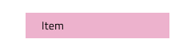
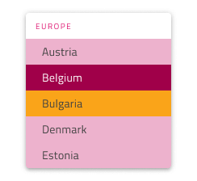

# Dropdown (ドロップダウン)

Use the Dropdown Component to let the user select an item from a collection that is displayed upon user interaction in a scrollable list. Only one item can be selected at a time and if your scenario requires the selection of multiple items, you should use the [Combo](combo.md) instead. The Dropdown is visually identical to the [Ignite UI for Angular Dropdown Component](https://jp.infragistics.com/products/ignite-ui-angular/angular/components/drop_down.html)

## Dropdown デモ

## タイプ

Dropdown は、デスクトップとモバイルで使用時に適切なサイズで提供されます。

## 項目

Dropdown は、項目ヘッダーと項目の 2 つのタイプをサポートします。ヘッダーでグループの他の項目を体系化できます。

## 項目の状態

Dropdown 項目は、5 つの状態をサポートします。disabled, **Idle**、Focused、Selected、Selected&focused。

## Item Layout Template

The Dropdown Item supports flexible icon and label templating achievable by setting the elements you want to hide to ~No Symbol from the overrides panel. By default, the icon is hidden with this approach.

 

## スタイル設定

Dropdown は、背景色を制御するオーバーライドによるスタイル設定、項目やヘッダー背景、テキスト色を含む項目に関連するさなざまなオーバーライドに高い柔軟性があります。

## 使用方法

Dropdown 使用時は、表示をトリガーする項目に従ってコンテンツの最上部に表示する必要があります。Dropdowns don't push content like an expansion panel would.

| 良い例                                                                                 |悪い例                                                                                  |
| ---------------------------------------------------------------------------------- | -------------------------------------------------------------------------------------- |
|  |  |

## その他のリソース

関連トピック:

- [Combo](combo.md)
  

コミュニティに参加して新しいアイデアをご提案ください。
