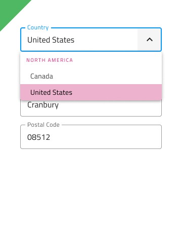

# Dropdown (ドロップダウン)

Dropdown コンポーネントでは、ユーザーがスクロール可能なリストでユーザー インタラクションに応じて表示されるコレクションから項目を選択できます。一度に 1 つの項目のみ選択できます。複数の項目を選択する必要がある場合は、代わりに [Combo](combo.md) を使用してください。Dropdown は、[Ignite UI for Angular Dropdown コンポーネント](https://jp.infragistics.com/products/ignite-ui-angular/angular/components/drop_down.html)と視覚的に同じです。

## Dropdown のデモ

## タイプ

Dropdown は、デスクトップとモバイルで使用時に適切なサイズで提供されます。

## バリアント

Dropdown は、明暗バリアント (デフォルトは**暗い**) で分かりやすく、背景に明暗のコントラストを付けてスタイル設定できます。

## 項目

Dropdown は、項目ヘッダーと項目の 2 つのタイプをサポートします。ヘッダーでグループの他の項目を体系化できます。

## 項目の状態

Dropdown 項目は、5 つの状態をサポートします: Disabled、**Idle**、Focused、Selected、Selected&focused。Sketch ではこれを `Symbol Overrides` で実現していますが、Adobe XD では `Component States` パラダイムを使用して簡単に状態を切り替えることができます。

## 項目レイアウト テンプレート

Dropdown Item は柔軟なアイコンとラベルのテンプレートをサポートします。Sketch でアイコンを表示するには、オーバーライドを Icon/Medium に設定し、スマート レイアウト ルールが項目レイアウトを自動的に調整します。Adobe XD では、アイコン レイヤーを表示し、Stack に配置してレイアウトを自動的に調整することで同じことが可能ですが、コンテンツにアイコンのある項目が必要ない場合は、アイコン レイヤーを削除します。

 

## スタイル設定

Dropdown には、背景色のスタイルの柔軟性に加えて、項目やヘッダーの背景色やテキストの色など、含まれる要素に関連するさまざまなオプションがあります。

## 使用方法

Dropdown 使用時は、表示をトリガーする項目に従ってコンテンツの最上部に表示する必要があります。ドロップダウンは、展開パネルのようにコンテンツをプッシュしません。

| 良い例                                                                                 | 悪い例                                                                                  |
| ---------------------------------------------------------------------------------- | -------------------------------------------------------------------------------------- |
|  |  |

## その他のリソース

関連トピック:

- [Combo](combo.md)
- [Select](select.md)
  

コミュニティに参加して新しいアイデアをご提案ください。
