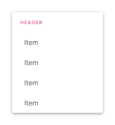
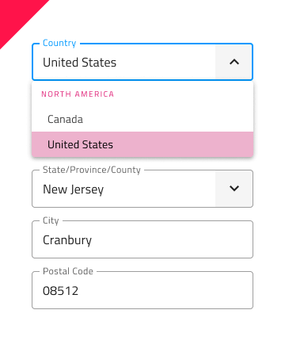

# Dropdown (ドロップダウン)

Dropdown コンポーネントでは、ユーザーがスクロール可能なリストでユーザー インタラクションに応じて表示されるコレクションから項目を選択できます。一度に 1 つの項目のみ選択できます。複数の項目を選択する必要がある場合は、代わりに [Combo](combo.md) を使用してください。Dropdown は、[Ignite UI for Angular Dropdown コンポーネント](https://jp.infragistics.com/products/ignite-ui-angular/angular/components/drop_down.html)と視覚的に同じです。

## Dropdown のデモ

## サイズ

Dropdown には 3 つのサイズがあります: Large、Medium および Small です。

## 項目

Dropdown は 2 つの項目タイプ (header と item) をサポートし、Large、Medium、Small の 3 つのサイズで利用できます。ヘッダーでグループの他の項目を体系化できます。

## 項目の状態

ドロップダウン項目は、**Idle (アイドル)**、**Hover (ホバー)**、**Disabled (無効)**、**Focused (フォーカス済み)**、**Selected (選択済み)**、**Selected & Hover (選択済みおよびホバー)**、**Selected & Focused (選択済みおよびフォーカス済み)** の 7 つの異なる状態をサポートしています。Figma では、状態は `State` プロパティおよび/または Selected と Disabled のブール値プロパティを変更することで異なるバリアントを実現できます。

|  | Idle | Hover | Focused | Disabled |
|  | ---- | ----- | ------- | -------- |
|  |  |  |  |  |
| 選択済み |  |  |  |

## 項目レイアウト テンプレート

Dropdown Item は柔軟なアイコンとラベルのテンプレートをサポートします。Figma では、1 つ以上の項目を選択し、`Prefix Icon` および/または `Suffix Icon` プロパティを有効にすることで、Dropdown にプレフィックス アイコンとサフィックス アイコンを追加できます。

 
 

## スタイル設定

Dropdown には、背景色のスタイルの柔軟性に加えて、項目やヘッダーの背景色やテキストの色など、含まれる要素に関連するさまざまなオプションがあります。

## 使用方法

Dropdown 使用時は、表示をトリガーする項目に従ってコンテンツの最上部に表示する必要があります。ドロップダウンは、展開パネルのようにコンテンツをプッシュしません。

| 良い例                                                                                 | 悪い例                                                                                  |
| ---------------------------------------------------------------------------------- | -------------------------------------------------------------------------------------- |
|  |  |

## その他のリソース

関連トピック:

- [Combo](combo.md)
- [Select](select.md)
  

コミュニティに参加して新しいアイデアをご提案ください。
