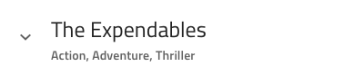
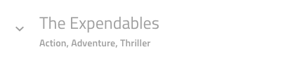
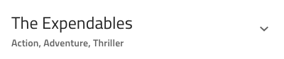
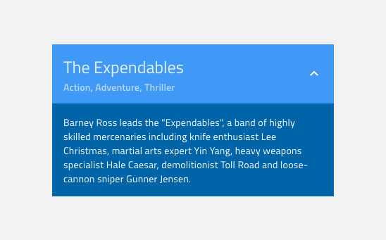
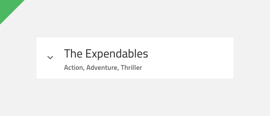
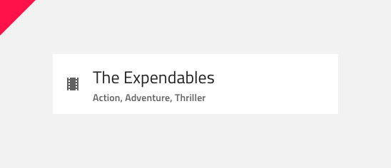

# Expansion Panel (展開パネル)

画面スペースを維持する方法として、Expansion Panel コンポーネントを使用します。たとえば、テキストがたくさんあり、Header のタイトルで初期情報を表示してテキストを非表示にしたい場合や、開いたときに Body のコンテンツで詳細を表示したい場合です。 
Expansion Panel には、Collapsed (縮小) 状態と Expanded (展開) の 2 つの主要な状態があります。
Expansion Panel は、[Ignite UI for Angular Expansion Panel コンポーネント](https://jp.infragistics.com/products/ignite-ui-angular/angular/components/expansion-panel.html)と視覚的に同じです。

## Expansion Panel のデモ

## Header State (ヘッダーの状態)

Expansion Panel のヘッダーは、**Active (有効)** および Disabled (無効) 状態になります。You can switch between them using the Disabled boolean operation in Figma, using the Overrides panel in Sketch and from the States section in the right panel of Adobe XD.

`Active`

`Disabled`

## Header Layout (ヘッダーのレイアウト)

Expansion Panel の Header Layout は、Left Expansion Panel Icon (左側の拡張パネル アイコン)、Title (タイトル) と Description (説明) を含む Content (コンテンツ)、および Right Expansion Panel Icon (右側の拡張パネル アイコン) で構成されます。In Figma there are Icon and Description properties, which let you modify the layout. By default the Right Expansion Panel Icon is set to ~No Symbol in Sketch and is hidden in Adobe XD. Left Expansion Panel Icon と Content は、Sketch ではスマートなレイアウトになっており、Adobe XD では Stack を形成します。つまり、Icon が非表示になっている場合、Content は自動的に左に移動します。ただし、そうする場合は、Right Expansion Panel Icon を表示し、左側のアイコンを Sketch で ~No Symbol に設定するか、Adobe XD で削除することを忘れないでください。

## Body (本体)

Expansion Panel の Body には、展開状態でのみ表示されるテキスト段落が含まれています。

## スタイル設定

Expansion Panel には、Header と Body の両方の背景色、およびテキストとアイコンの色を変更するためのオプションが付属しています。

## 使用方法

Expansion Panel を使用するときは、その使用法を適切に理解できるアイコンを使用してください。つまり、パネルを拡張すると、より多くのコンテンツを利用できるようになります。

| 良い例                                                                             | 悪い例                                                                              |
| ------------------------------------------------------------------------------ | ---------------------------------------------------------------------------------- |
|  |  |

## その他のリソース

関連トピック:

- [Icon](icon.md)
  

コミュニティに参加して新しいアイデアをご提案ください。
