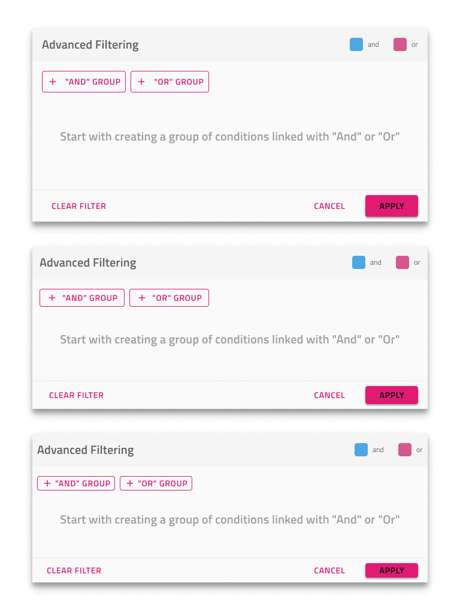

# Grid Advanced Filter (グリッドの高度なフィルター)

Grid Advanced Filter を使用すると、Grid 上に表示されるダイアログで複数の Grid 列にまたがる高度なフィルター条件を指定できます。Grid 高度なフィルターは、[Ignite UI for Angular Grid 高度なフィルタリング機能](https://jp.infragistics.com/products/ignite-ui-angular/angular/components/grid/advanced-filtering.html)と視覚的に同じものです。

## Grid Advanced Filter のデモ

## 高度なフィルター機能

グリッドには、`Features` の下に 3 つの `Advanced Filtering` コンポーネントがあり、各サイズに 1 つずつ、グリッド上に表示されるオーバーレイを表します。Figma では、プロパティ パネルの専用 `Size` プロパティを使用して、さまざまなサイズを切り替えることができます。

## フィルター式状態

高度なフィルター機能には、デフォルトで **Empty Filter** 式があり、必要に応じて **Applied Filter** に変更できます。Figma でデフォルトの空の状態を変更するには、レイヤー パネルで `Filter Expression State` コンポーネントを見つけて、コンポーネントの `Type` プロパティを `Empty Filter` から `Applied Filter` に切り替える必要があります。これを設定したら、必要なフィルタリング基準を指定してさらにカスタマイズできます。

## ツールバー

Grid 高度なフィルターは、Grid 全体の機能を有効にする Advanced Filter 操作を備えた Toolbar を追加することで実現されます。

## その他のリソース

関連トピック:

- [Grid](grid.md)
- [Grid 行フィルター](grid-row-filter.md)
- [Grid Excel スタイル フィルター](grid-excel-style-filter.md)
- [Grid ツールバー](grid-toolbar.md)
  

コミュニティに参加して新しいアイデアをご提案ください。
