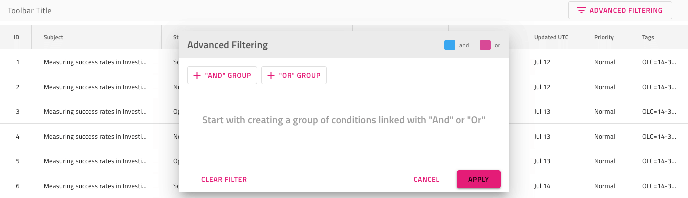
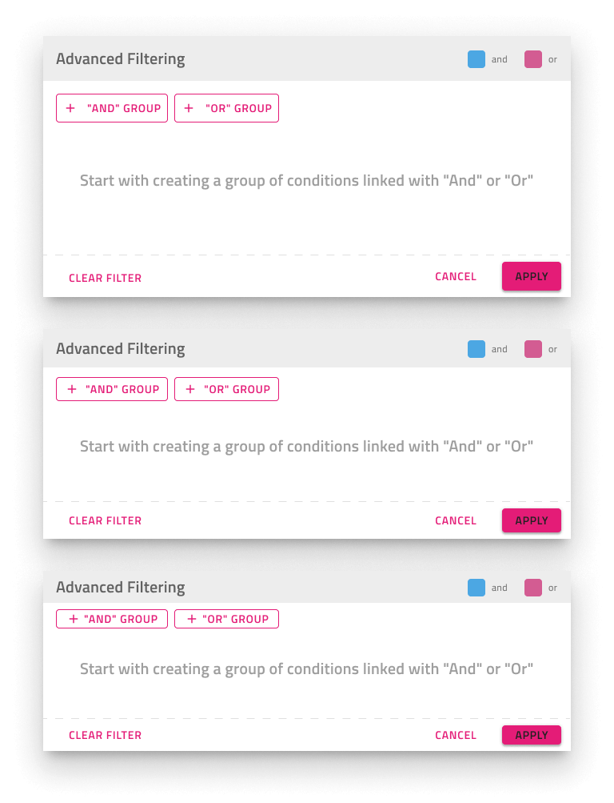
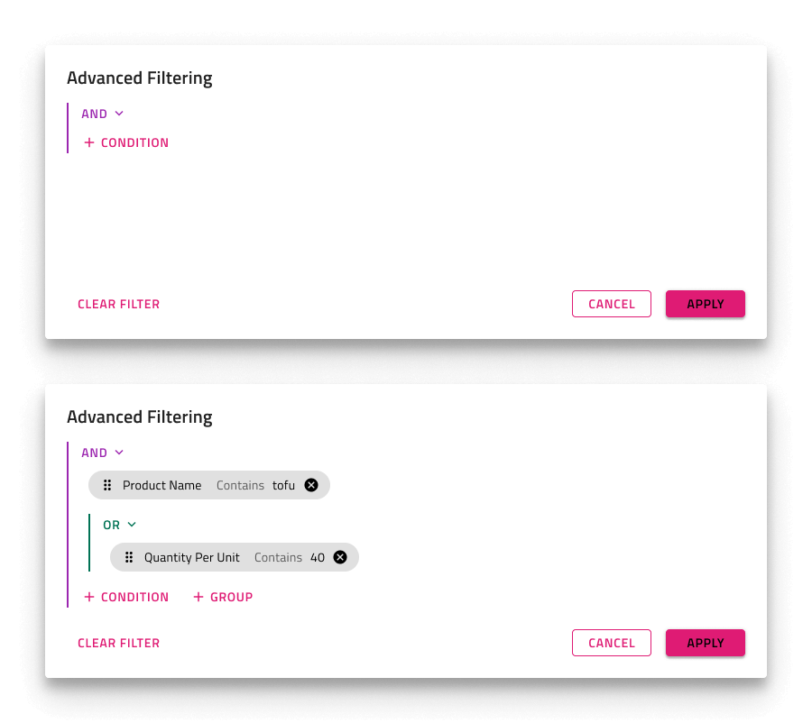

# Grid Advanced Filter (Grid 高度なフィルター)

Grid 高度なフィルターを使用すると、Grid 上に表示されるダイアログで複数の Grid 列にまたがる高度なフィルター条件を指定できます。Grid 高度なフィルターは、[Ignite UI for Angular Grid 高度なフィルタリング機能](https://jp.infragistics.com/products/ignite-ui-angular/angular/components/grid/advanced-filtering.html)と視覚的に同じものです。

## Grid 高度なフィルターのデモ

## 高度なフィルター機能

グリッドには、`Features` の下に 3 つの `Advanced Filtering` シンボルがあり、各表示密度に 1 つずつ、グリッド上に表示されるオーバーレイを表します。In Figma you can switch between the different display densities via the dedicated property in the properties panel. In Adobe XD you can switch between display densities through the `Component States`.

## フィルター式状態

高度なフィルター機能には、デフォルトで **Empty Filter** 式があり、必要に応じて Applied Filter に変更できます。Sketch では、これを `Symbol Overrides` で実現していますが、Adobe XD では `Component States` パラダイムを使用して簡単に状態を切り替えることができます。これを設定したら、必要なフィルタリング基準を指定してさらにカスタマイズできます。In Figma, to change the default empty state you need to find the `Filter Expression State` component in the layers panel and switch the property of the component from `Empty Filter` to `Applied Filter`.

## ツールバー

Grid 高度なフィルターは、Grid 全体の機能を有効にする Advanced Filter 操作を備えた Toolbar を追加することで実現されます。

## その他のリソース

関連トピック:

- [Grid](grid.md)
- [Grid 行フィルター](grid-row-filter.md)
- [Grid Excel スタイル フィルター](grid-excel-style-filter.md)
- [Grid ツールバー](grid-toolbar.md)
  

コミュニティに参加して新しいアイデアをご提案ください。
