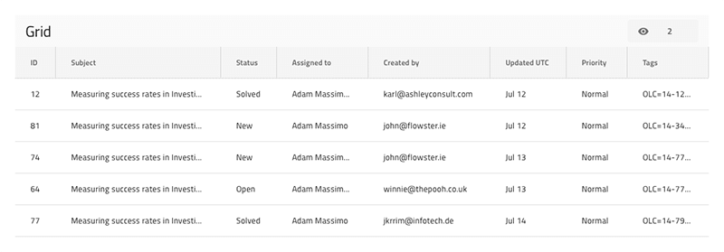

# 列非表示

Grid 列非表示は、グリッドから特定の列を非表示にするために使用します。列を再び表示するためのインターフェイスを提供する最も簡単な方法は、ツールバーを追加することです。ツールバーには、デフォルトで グリッド全体の列の表示を構成できるボタン (コンボと組み合わせ) が含まれます。Grid 列非表示は、[Ignite UI for Angular Grid 列非表示機能](https://jp.infragistics.com/products/ignite-ui-angular/angular/components/grid/column_hiding.html) と視覚的に同じものです。

## Grid 列非表示デモ

## ツールバーとヘッダー セル

Grid の列非表示は、グリッド全体の機能を有効にする列非表示アクションのツールバーを追加することで実現できます。ただし、特定の列を非表示としてマークするには、各列のグリッド ヘッダー セルで `Column hiding` のオーバーライドを設定し、非表示に設定する必要があります。このプロパティのデフォルト設定は、**Visible** です。

## その他のリソース

関連トピック:

- [Grid](grid.md)
- [Grid ツールバー](grid-toolbar.md)
  

コミュニティに参加して新しいアイデアをご提案ください。
