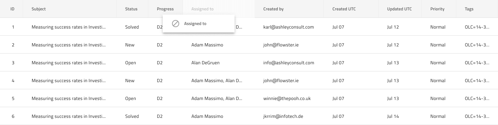

## 列移動

Grid 列移動は、グリッドの列が移動可能であり、ヘッダー セルをドラッグして目的の場所にドロップすることで再配置できることを示すために使用します。Grid 列移動は、[Ignite UI for Angular Grid 列移動機能](https://jp.infragistics.com/products/ignite-ui-angular/angular/components/grid/column_moving.html)と視覚的に同じものです。

### Grid 列移動デモ

### ヘッダー セル

列が移動可能であることを示するには、デフォルト値を **Not Movable** から Movable に変更すると、列のグリッド ヘッダー セルの `Column Moving` のオーバーライドを設定します。また、コード生成には、これにより列を移動可能としてマークします。
デフォルト値は、**太字**テキストでスタイル設定されます。

### 列移動機能

Grid の`機能`の下には、ドラッグされた列に表示されるゴースト ヘッダー セルを表す`列移動`シンボルがあります。このシンボルを追加すると、デザインに視覚的な効果のみでよりリアルになります。列移動機能を切り替えたい場合は、ヘッダー セルを構成します。

## コードの生成

`列移動`シンボルを追加する場合、ヘッダー グループと本文グループの兄弟としてグリッドを定義するグループ内に配置してください。

## その他のリソース

関連トピック:

- [Grid](grid.md)
  

コミュニティに参加して新しいアイデアをご提案ください。
