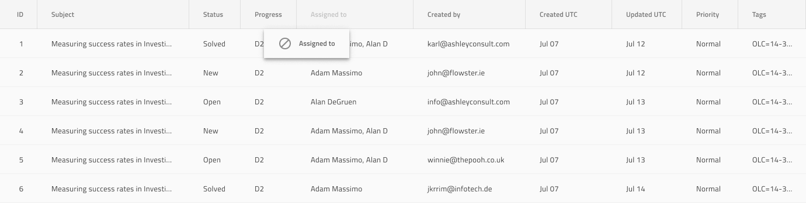

# Grid Column Moving (グリッド列移動)

Grid 列移動は、グリッドの列が移動可能であり、Header Cell をドラッグして目的の場所にドロップすることで再配置できることを示すために使用します。Grid 列移動は、[Ignite UI for Angular Grid 列移動機能](https://jp.infragistics.com/products/ignite-ui-angular/angular/components/grid/column_moving.html)と視覚的に同じものです。

## Grid 列移動のデモ

## Header Cell (ヘッダー セル)

列が移動可能であることを示するには、デフォルト値を **Not Movable** から Movable に変更すると、列の Grid Header Cell の `Column Moving` のオーバーライドを設定します。また、コード生成には、これにより列を移動可能としてマークします。

## Column Moving Feature (列移動機能)

Grid の `Features` の下には、ドラッグされた列に表示されるゴースト Header Cell を表す `Column Moving` シンボルがあります。数値列とテキスト列のプリセットが付属しています。このシンボルを追加すると、デザインに視覚的な効果のみでよりリアルになります。列移動機能を切り替えたい場合は、Header Cell を構成します。

## その他のリソース

関連トピック:

- [Grid](grid.md)
  

コミュニティに参加して新しいアイデアをご提案ください。
