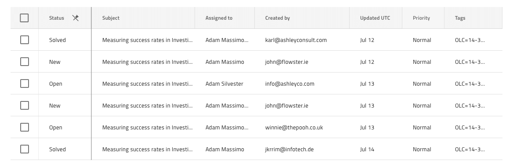
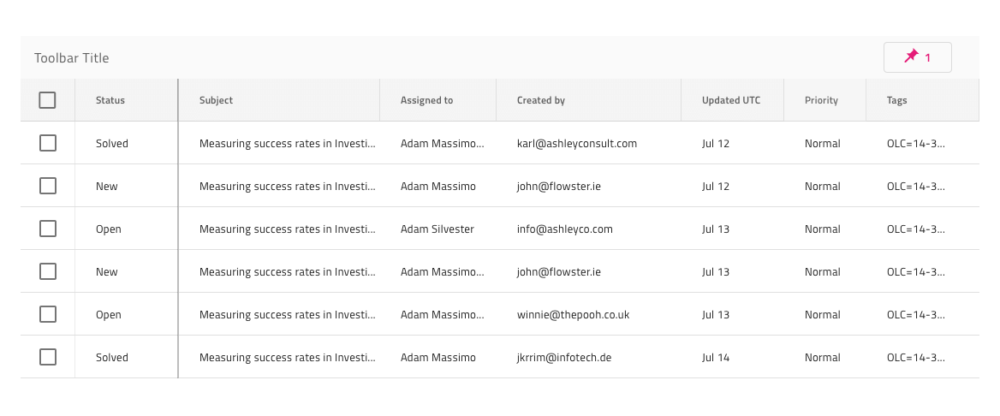

---
title: Grid 列ピン固定 - グリッド機能
_description: Grid 列ピン固定は、スクロール可能なグリッドで選択された列をピン固定するための構造です。 
_keywords: デザイン システム, デザイン システム UX, UI キット, Sketch, Ignite UI for Angular, Sketch to Angular, Angular, Angular デザイン システム, Sketch からコードをエクスポート, Angular 用のデザイン キット, Sketch HTML, Sketch to HTML, Sketch UI キット
_language: ja
---

# 列ピン固定

Grid 列ピン固定は、スクロール可能なグリッドで最初の数列を左に固定するための構造として使用します。ユーザーがスクロールすると、ピン固定された列以外、すべての他の列は右や左に移動します。ピン固定列は常にスクロール可能な列の上に表示されます。Grid 列ピン固定は、[Ignite UI for Angular Grid 列ピン固定機能](https://jp.infragistics.com/products/ignite-ui-angular/angular/components/grid_column_pinning.html)と視覚的に同じものです。

## Grid 列ピン固定のデモ

## ヘッダー セル機能

列をピン固定可能として示すには、Sketch でその列の Grid Header Cell の `Column Pinning` オーバーライドを使用し、デフォルト値を **Not Pinned** (ピン固定されていない) から Pinned (ピン固定されている) に変更します。Adobe XD では、`Column Pinning` レイヤーは `Component States` パラダイムを使用して、状態を簡単に切り替えることができます。コード生成には、これにより列をピン固定可能としてマークします。

組み込みの列の固定は、Grid のツールバーから使用できます。このツールバーには、デフォルトで、グリッド全体の列のピン固定状態を構成できるボタン (コンボ ドロップダウンと組み合わせて) が含まれています。

## カスタム列ピン固定

`Feature Left` または `Feature Right` オーバーライドを使用して `Icon Template` に設定することにより、Grid Header Cell にカスタムピン固定操作を追加することもできます。このようにして、列がピン固定されていることを示すアイコンが表示され、Icon のオーバーライドからアイコンのピン固定を解除できます。もちろん、左から右に見るときにピン固定されたものが最初に来るように、列の順序を並べ替えることもできます。

## セルの右境界線

右端の列には、ヘッダーと列のすべての本体セルの両方に対して `Pinned Line` を示す `Right Border` のオーバーライドが必要です。件名列はピン固定されているため、2 行の 2 列目のすべてのセルで実行されます。これは下の画像に表示されています。

## その他のリソース

関連トピック:

- [Grid](grid.md)
  

コミュニティに参加して新しいアイデアをご提案ください。
