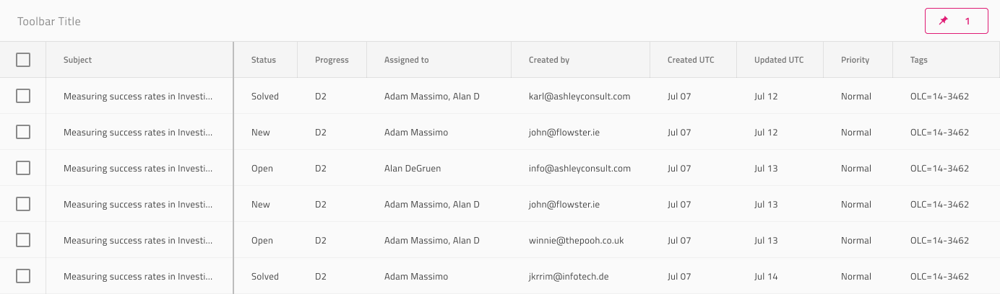

# Grid Column Pinning (グリッドの列ピン固定)

Grid Column Pinningは、スクロール可能なグリッドで最初の数列を左に固定するための構造として使用します。ユーザーがスクロールすると、ピン固定された列以外、すべての他の列は右や左に移動します。ピン固定列は常にスクロール可能な列の上に表示されます。Grid 列ピン固定は、[Ignite UI for Angular Grid 列ピン固定機能](https://jp.infragistics.com/products/ignite-ui-angular/angular/components/grid_column_pinning.html)と視覚的に同じものです。

## Grid Column Pinning のデモ

## Header Cell Feature (ヘッダー セル機能)

ヘッダー セル機能としての Grid Column Pinning は Figma では非推奨になっており、App Builder を使用してデザインを生成する場合は、コード生成後に直接適用する必要があります。

組み込みの列の固定は、Grid のツールバーから使用できます。このツールバーには、デフォルトで、グリッド全体の列のピン固定状態を構成できるボタン (コンボ ドロップダウンと組み合わせて) が含まれています。

## カスタム列ピン固定

Grid Header Cell にカスタムピン固定操作を追加することもできます。Figma では、Header Cell レイヤーに移動し、`Feature Left` または `Feature Right` を選択し、その `Type` プロパティを `None` から `Icon Template` に変更する必要があります。もちろん、左から右に見るときにピン固定されたものが最初に来るように、列の順序を並べ替えることもできます。

## セルの右境界線

右端の列には、ヘッダーと列のすべての本文セルの両方に対して `Pinned Line` を `Right Border` に設定する必要があります。「Status」 がピン固定されているため、これは下の画像で 2 列目のすべてのセルに表示されます。 

## その他のリソース

関連トピック:

- [Grid](grid.md)
  

コミュニティに参加して新しいアイデアをご提案ください。
