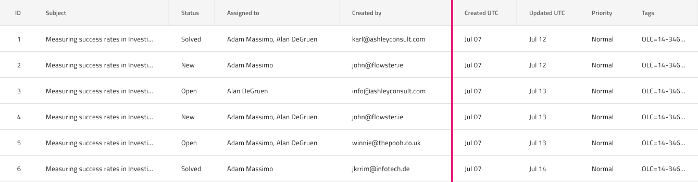

## 列サイズ変更

Grid 列サイズ変更は、グリッド列のサイズ変更が可能なできることを示します。ユーザーがハンドルとしてヘッダーの右端をグラブすると、列の幅を調整できます。Grid 列サイズ変更は、[Ignite UI for Angular Grid 列サイズ変更機能](https://jp.infragistics.com/products/ignite-ui-angular/angular/components/grid/column_resizing.html) と視覚的に同じものです。

### Grid 列サイズ変更デモ

### ヘッダー セル

列がサイズが変更可能であることを示するには、デフォルト値を **Not Resizable** から Resizable に変更すると、列のグリッド ヘッダー セルの `Column Resizing` のオーバーライドを設定します。また、コード生成には、これにより列がサイズ変更可能としてマークします。
デフォルト値は、**太字**テキストでスタイル設定されます。

### 列サイズ変更インジケーター機能

グリッドの`機能`の下には、サイズ変更が発生する列全体の強調表示境界線を表す `列サイズ変更インジケーター`シンボルがあります。このシンボルを追加すると、デザインに視覚的な効果があるのみで、よりリアルになります。列サイズ変更機能を切り替えたい場合は、ヘッダー セルを構成します。

## コードの生成

`列サイズ変更インジケーター` シンボルを追加する場合、ヘッダーグループと本体グループの兄弟として グリッドを定義するグループ内に配置してください。

## その他のリソース

関連トピック:

- [Grid](grid.md)
  

コミュニティに参加して新しいアイデアをご提案ください。
