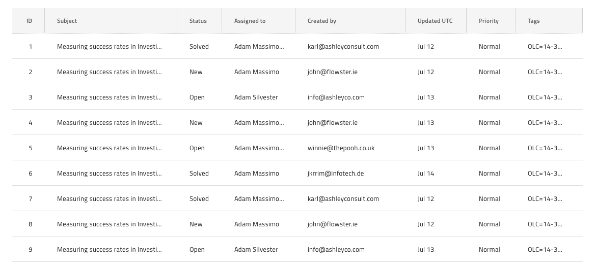
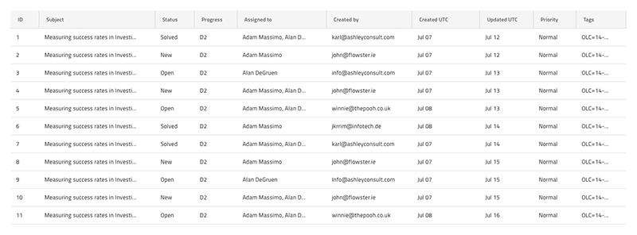
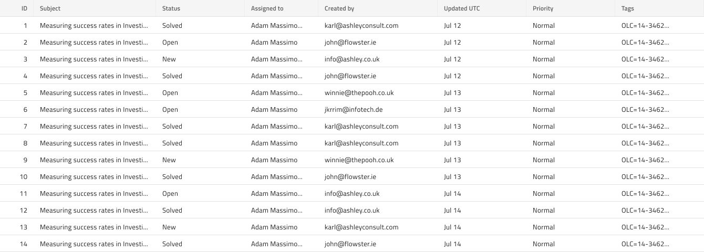

## Grid 表示密度

Grid には、comfortable、cosy、compact の 3 つのサポートされる密度に従って、3 つのビルド済みバリアントがあります。最初のバリエーションは最もライトなレイアウトで、最後のレイアウトは最も密度が高くなります。Grid 表示密度は、[Ignite UI for Angular Grid 表示密度機能](https://jp.infragistics.com/products/ignite-ui-angular/angular/components/grid/display_density.html) と視覚的に同じものです。

グリッドに表示するデータが多いほど、レイアウトの密度が高くなります。これにより、Header や Body Cells、オーバーレイ、ダイアログなどのすべての要素のレイアウトに空白が次第に減少し、ツールバーや集計などメインコンテンツの上または下にグリッドに添付される要素も減少します。

### Grid 表示密度 - Comfortable

### Grid 表示密度 - Cosy

### Grid 表示密度 - Compact

> [!Note]
> 表示密度を使用する場合は、すべてのグリッド要素と機能が同じ表示密度タイプを使用することを確認してください。

## その他のリソース

関連トピック:

- [Grid](grid.md)
  

コミュニティに参加して新しいアイデアをご提案ください。
