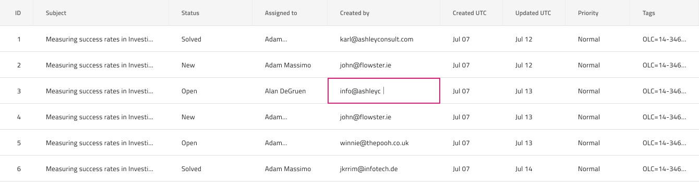
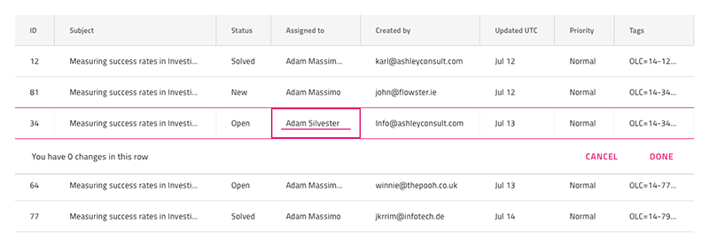

# Grid Editing (グリッド編集)

Grid 編集は、ユーザーが特定の値をセルごとまたは一度に 1 行を更新できるために使用します。セル編集と行編集の両方は、[Ignite UI for Angular Grid 編集機能](https://jp.infragistics.com/products/ignite-ui-angular/angular/components/grid/editing.html)と視覚的に同じものです。

## セルの編集

Grid セルの編集はセルごとに行われ、Sketch の `Grid Feature` オーバーライド、または Figma のプロパティ パネルの `Grid Feature` コンポーネントのプロパティで編集モードに表示する Body Cell で構成されます。Adobe XD では、`Grid Feature` レイヤーは `Component States` パラダイムを使用して同様のメカニズムを提供します。`Grid Feature` を `Cell Feature/Cell Editing` に設定すると、このモードに遵守する編集可能なグリッドが作成されます。

## 行の編集

Grid 行編集は一度に 1 行ずつ行われ、`Grid Features` のオーバーライドを `Cell Feature/Row Editing` に設定すると、編集された行に属する Body Cell で構成されます。Sketch では、2 番目のオーバーライド `Editing State` を導入し、`Focus Cell` に設定することで、フォーカスされるセルを指定できます。この行の他のすべてのセルを `Rest Cell` に設定する必要があることに注意してください。Adobe XD では、上記の両方が `Grid Feature` レイヤーの `Component States` として使用できます。Figma で行が編集状態であることを示すには、その行内のすべてのセルの `Variant` プロパティを変更する必要があります。これを行うには、各本文セルの下のレイヤー パネルで `Grid Feature` レイヤーを選択し、バリアントを `Row Editing Rest` に変更します。フォーカスされたセルとして表示したいセルのバリアントを `Row Editing Focused` に変更します。

## Row Banner の編集

グリッドの `Features` の下には、集計領域を表す `Editing Row Banner` シンボルがあります。この集計領域は行で行われた編集の数と行で行われた編集をキャンセルおよび確認するための一組のアクションを含みます。このシンボル / コンポーネントを追加すると、デザインに視覚的な効果があるのみで、よりリアルになります。行編集機能を切り替えたい場合は、行のセルを構成します。

## その他のリソース

関連トピック:

- [Grid](grid.md)
  

コミュニティに参加して新しいアイデアをご提案ください。
