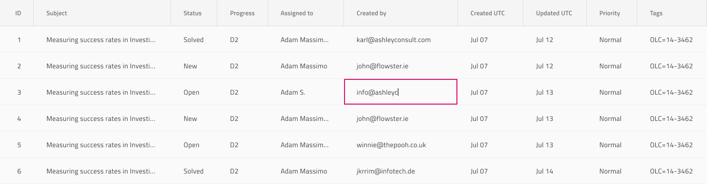
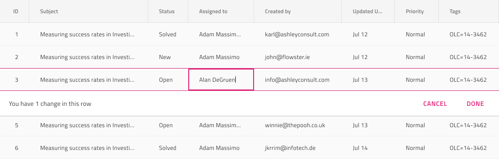

# Grid Editing (グリッドの編集)

Grid Editing は、ユーザーが特定の値をセルごとまたは一度に 1 行を更新できるために使用します。セル編集と行編集の両方は、[Ignite UI for Angular Grid 編集機能](https://jp.infragistics.com/products/ignite-ui-angular/angular/components/grid/editing.html)と視覚的に同じものです。

## セルの編集

Grid Cell Editing はセルごとに行われ、編集モードに表示する Body Cell で構成されます。Figma では、各本文セル内のネストされた `Cell State` コンポーネントのプロパティ パネルから `Focused` 状態を選択することでこれを実現します。

## 行の編集

Grid Row Editing は一度に 1 行ずつ行われ、編集された行に属する Body Cell で構成されます。Figma では、行が編集状態であることを示すには、その行内のすべてのセルの `Row Editing` ブール値プロパティをオンにする必要があります。編集中のセルについては、`Row Editing` ブール値プロパティをオンにするだけでなく、`State` バリアント プロパティを `Focused` に変更する必要もあります。

## Row Banner の編集

Grid の `Grid Features` の下には、集計領域を表す `Editing Row Banner` コンポーネントがあります。この集計領域は行で行われた編集の数と行で行われた編集をキャンセルまたは確認するための一組のアクションを含みます。このコンポーネントを追加すると、デザインに視覚的な効果があるのみで、よりリアルになります。行編集機能を切り替えたい場合は、行のセルを構成します。

## その他のリソース

関連トピック:

- [Grid](grid.md)
  

コミュニティに参加して新しいアイデアをご提案ください。
