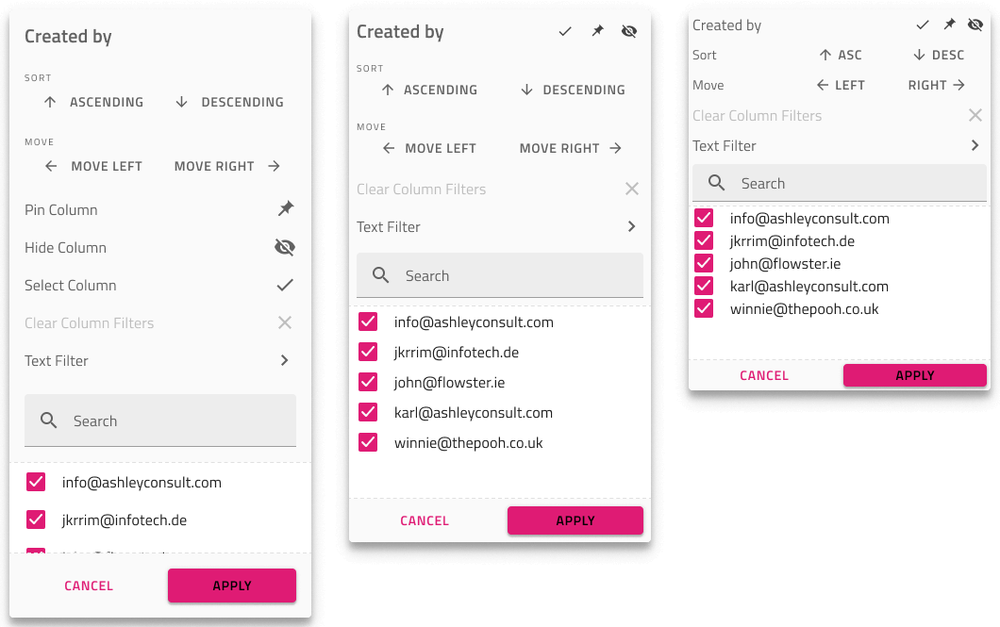

# Grid Excel Style Filter (グリッドの Excel スタイル フィルター)

グリッド Excel スタイル フィルターは、ユーザーが列に一連のグリッド機能を指定できるために使用します: 一意の値または複数の条件でフィルタリング、ソート、列選択、列移動、列非表示、ピン固定。Excel Style Filter は一度に 1 つの列のみに表示でき、そのヘッダー セルでは `Feature Left` または `Feature Right` が `Filtering Active` に設定されている必要があります (以下の Header Cell を参照)。このフィルターは、[Ignite UI for Angular Grid Excel スタイル フィルタリング機能](https://jp.infragistics.com/products/ignite-ui-angular/angular/components/grid/excel_style_filtering.html)と視覚的に同じものです。

## Excel スタイル フィルターのデモ

## Header Cell (ヘッダー セル)

Figma で Excel スタイル フィルタリングを使用するには、Grid Header Cell レイヤーを開き、`Feature Left` または `Feature Right` コンポーネントを選択し、`Type` プロパティを `Filtering Inactive`、`Filtering Active`、または `Filtering Filtered` に変更する必要があります。

## Excel Style Filter Feature (Excel スタイル フィルター機能)

Figma では、`Grid Features` の下に `Excel Style Filter` コンポーネントがあり、`Size` プロパティを使用して、使用可能な 3 つのサイズを簡単に切り替えることができます。Excel Style Filter を追加すると、デザインに視覚的な効果があるのみで、よりリアルになります。Excel Style Filter 機能をオンにしたい場合は、Header Cells を構成します。

> [!Note]
> グリッドのすべての機能に継承されるため、Grid Size に一致する Excel スタイル フィルターの Size バリアントを選択してください。

### オーバーレイのカスタマイズ

Excel スタイル フィルター オーバーレイを使用すると、列名を構成して、その列をトリガーした列および On/Off 状態と項目テキストを含む下部の一意の値のリストを反映できます。他の機能は構成できません。

### ソート、選択、移動、非表示、ピン固定

Excel スタイル フィルター インターフェイスは、フィルタリング以外にソート、列選択、列移動、列非表示、列ピン固定など、構成できない追加機能を提供します。

## その他のリソース

関連トピック:

- [Grid](grid.md)
- [Grid 行フィルター](grid-row-filter.md)
- [Grid 高度なフィルター](grid-advanced-filter.md)
- [Grid サイズ](grid-sizes.md)
- [Grid ソート](grid-sorting.md)
- [Grid 列移動](grid-column-moving.md)
- [Grid 列非表](grid-column-hiding.md)
- [Grid 列ピン固定](grid-column-pinning.md)
  

コミュニティに参加して新しいアイデアをご提案ください。
