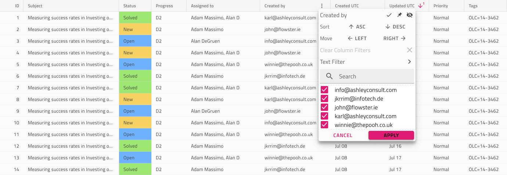

# Grid Excel Style Filter (グリッド Excel スタイル フィルター)

グリッド Excel スタイル フィルターは、ユーザーが列に一連のグリッド機能を指定できる機能です。一意の値または複数の条件でフィルタリング、並べ替え、列移動、列非表示、ピン固定。一度に 1 列にのみ Excel スタイル フィルターを示し、Header Filter 状態はアクティブに設定する必要があります (以下 Header Cell 参照)。このフィルターは、[Ignite UI for Angular Grid グリッド Excel スタイル フィルタリング機能](https://jp.infragistics.com/products/ignite-ui-angular/angular/components/grid/excel_style_filtering.html)と視覚的に同じものです。

## Excel スタイル フィルター デモ

## Header Cell (ヘッダー セル)

列に Excel スタイル フィルターがアクティブであることを示すには (フィルターのオーバーレイが表示されます)、`Feature Left` または `Feature Right` のオーバーライドを `Filtering` に設定し、`Filter State` パネルで次のオーバーライドを `Filtering/Active` に設定する必要があります。列で Excel スタイル フィルタリングが有効が有効にされたことを示すため、フィルタリング条件がこの列に適用されていないことを示す `Filtering/Inactive` 状態、またはフィルタリング条件が適用され、列のオーバーレイが閉じられたことを示す `Filtering/Inactive` 状態を使用できます。

## Excel Style Filter Feature (Excel スタイル フィルター機能)

グリッドには、`Features` の下に3つの `Excel Style Filter` シンボルがあり、各 Display Density に 1 つずつ、影響を受ける列に表示されるオーバーレイを表します。このシンボルを追加すると、デザインに視覚的な効果があるのみですが、よりリアルになります。Excel Style Filter 機能を切り替えたい場合は、Header Cell を構成します。

> [!Note]
> グリッドのすべての機能に継承されるため、Grid Display Density に一致する Excel スタイル フィルター オーバーレイの Display Density バリアントを選択してください。

### オーバーレイのカスタマイズ

Excel スタイル フィルター オーバーレイを使用すると、列名を構成して、その列をトリガーした列および On/Off 状態と項目テキストを含む下部の一意の値のリストを反映できます。他の機能は構成できません。

### 並べ替え、移動、非表示、ピン固定

Excel スタイル フィルターのインターフェイスは、並べ替え、列移動、列非表示、列ピン固定などのフィルタリング以外の追加機能を提供します。これらの機能のオーバーライドはないため、構成できません。それらのいずれかが Header Cell を介して列で有効になっている場合 (それぞれのトピックで有効にする方法を参照)、機能のユーザーインターフェイス要素は適用されている Grid Display Density に従って Excel スタイル フィルター インターフェイスに表示されます 。

## その他のリソース

関連トピック:

- [Grid](grid.md)
- [Grid 行フィルター](grid-row-filter.md)
- [Grid 表示密度](grid-display-density.md)
- [Grid 並べ替え](grid-sorting.md)
- [Grid 列移動](grid-column-moving.md)
- [Grid 列非表](grid-column-hiding.md)
- [Grid 列ピン固定](grid-column-pinning.md)
  

コミュニティに参加して新しいアイデアをご提案ください。
