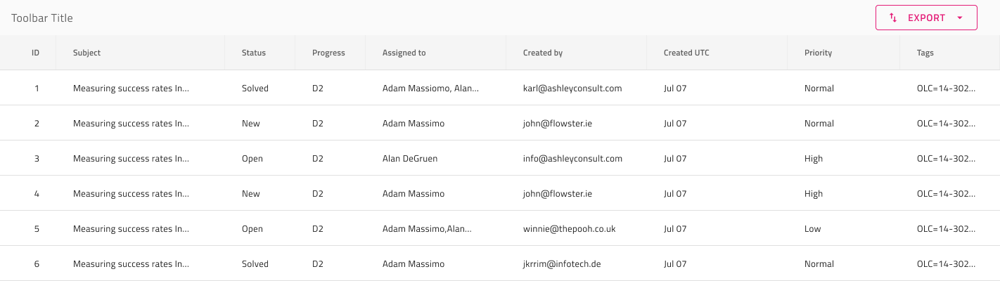

# エクスポート

Grid エクスポートは、ユーザーがのエクスポートは、Grid から Excel および CSV ファイルをエクスポートするために使用できます。Grid エクスポートは、[Ignite UI for Angular Grid ツールバー 機能](https://jp.infragistics.com/products/ignite-ui-angular/angular/components/grid/toolbar.html)の 2番目のサンプルと視覚的に同一であり、[Ignite UI for の Excel エクスポート機能](https://jp.infragistics.com/products/ignite-ui-angular/angular/components/grid/export_excel.html)と同様に動作します。

## Grid エクスポートのデモ

## ツールバー

Grid のエクスポートは、Grid 全体の機能を有効にするエクスポート 操作を備えた Toolbar を追加することで実現されます。

## コードの生成

ツールバーは、ヘッダーグループと本体グループの兄弟としてグリッドを定義するグループ内に配置してください。

## その他のリソース

Related topics:

- [Grid](grid.md)
- [Grid ツールバー](grid-toolbar.md)
  

コミュニティに参加して新しいアイデアをご提案ください。
