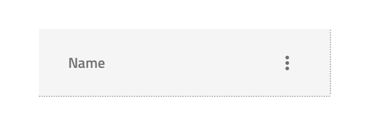
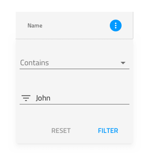

---
title: Grid フィルター - グリッド機能
_description: Grid フィルター コンポーネント シンボルは、Grid 行でフィルタリング条件を指定するダイアログがあります。
_keywords: デザイン システム, Sketch, Ignite UI for Angular, コンポーネント, Grid 機能, UI ライブラリ, ウィジェット
_language: ja
---

## Grid フィルター
Grid フィルター コンポーネントは、Grid 列でユーザーがフィルタリング条件を指定できます。一度に 1 列にのみ Grid フィルターを示し、ヘッダーのフィルター状態はアクティブに設定する必要があります (以下のフィルター状態を参照)。Grid フィルター機能は、[Ignite UI for Angular Grid フィルター機能](https://jp.infragistics.com/products/ignite-ui-angular/angular/components/grid_filtering.html)と視覚的に同じものです。

### Grid フィルター デモ

### フィルター状態

ヘッダー セルの Grid フィルター状態は、フィルタリングのインタラクションで選択できる 3 つの状態があります。**インアクティブ**状態は列でフィルタリングを適用可能であることを示します。アクティブ状態はフィルタリング条件を定義できるダイアログが表示されています。フィルター済み状態は、ダイアログが非表示になった後にフィルターが適用された状態を示します。

### スタイル設定

ヘッダー セルの Grid フィルター状態は、さまざまなオーバーライドでアイコンやアクティブな背景色などスタイル設定に柔軟性があります。Grid フィルター ダイアログは、さまざまなオーバーライドでダイアログの背景色などのスタイル設定に柔軟性があり、[Inputs](input.md) や [Flat Buttons](button.md) のスタイル設定も可能です。

## その他のリソース

関連トピック:

- [Button](button.md)
- [Grid](grid.md)
- [Input](input.md)
  

コミュニティに参加して新しいアイデアをご提案ください。

- [Indigo Design **GitHub** (英語)](https://github.com/IgniteUI/design-system-docfx)
