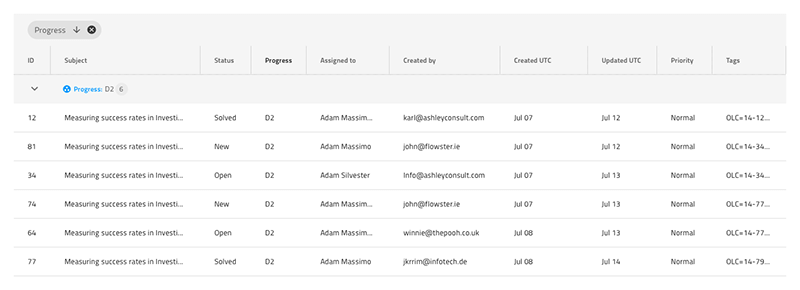

## Grid グループ化

Grid グループ化 を使用して、特定の列内の一致する値によって定義されたグループの階層コレクションでデータ レコードを整理します。グループ化の条件の順序は、Grid ヘッダーの上の特別な領域に表され、新しいグループの開始をマークするために、Grid レコードの間に特別な行が挿入されます。Grid グループ化は、[Ignite UI for Angular Grid のグループ化](https://jp.infragistics.com/products/ignite-ui-angular/angular/components/grid/groupby.html) と視覚的に同じものです。

### Grid グループ化のデモ

### グループ化領域

Grid には、`機能`の下に`グループ領域`シンボルがあり、レコードの階層グループを確立するために使用される列と、これらのグループがネストされる順序を指定します。挿入すると、`Detach from Symbol` を実行できます。内部には、グループ化がグリッドに適用される方法を定義する方法で構成できる[Chips 領域](chips.md) があります。

### 行でグループ化

グリッドには、`機能`の下にある`行でグループ化`シンボルがあります。これは、グループ化されたレコードの前にある見出しのようなグリッド内の特別な行を表します。グループ化機能を切り替えたい場合は、このシンボルを追加してもデザインに視覚的な効果があるだけで、よりリアルになります。それに応じて、`グループ エリア`を挿入して設定します。

## コードの生成

`行でグループ化`シンボルが追加される場合、グループを適用する方法をカスタマイズするために、ヘッダーとボディ グループの兄弟としてグリッドを定義するグループ内に配置し、それをデタッチします。

## その他のリソース

関連トピック:

- [Grid](grid.md)
- [Chips](chips.md)
  

コミュニティに参加して新しいアイデアをご提案ください。
