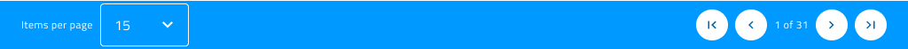

---
title: Grid ページング - グリッド機能
_description: Grid ページング コンポーネント シンボルには、ユーザーが現在いる Grid ページの情報を提供するフッターがあり、Grid コンテンツのページ間をナビゲーションを可能にします。 
_keywords: デザイン システム, デザイン システム UX, UI キット, Sketch, Ignite UI for Angular, Sketch to Angular, Angular, Angular デザイン システム, Sketch からコードをエクスポート, Angular 用のデザイン キット, Sketch HTML, Sketch to HTML, Sketch UI キット
_language: ja
---

## グリッド ページング

Grid ページング コンポーネントを使用して、ユーザーに現在の位置 (ユーザーが現在いるグリッドページ) を通知し、Grid コンテンツの前/次および最初/最後のページへのナビゲーションを許可します。Grid のすぐ下にギャップなしでグリッド ページングを配置します。Grid ページングは、[Ignite UI for Angular Grid ページング機能](https://jp.infragistics.com/products/ignite-ui-angular/angular/components/grid_paging.html) と視覚的に同じものです。

### Grid ページング デモ

### スタイル設定

Grid ページングは、さまざまなオーバーライドでラベルや背景色などのスタイル設定に柔軟性があり、ナビゲーションに使用する Icon Buttons のスタイル設定も可能です。

## コードの生成

Sketch ダイアグラムに Paging オブジェクトが追加された場合、ページングがグリッドで有効にされます。スタイルはページング色を設定するために使用されます。

## その他のリソース

関連トピック:

- [Button](button.md)
- [Grid](grid.md)
  

コミュニティに参加して新しいアイデアをご提案ください。
