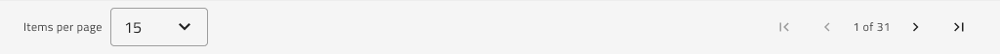

## Grid Paging

Use the Grid Paging Component to inform the user about his current position and allow navigation to the previous/next and first/last pages of content for the Grid. Position the Grid Paging immediately below the Grid without any gap between the two. The Grid Paging is visually identical to the [Ignite UI for Angular Grid Paging Feature](https://www.infragistics.com/products/ignite-ui-angular/angular/components/grid_paging.html)

### Grid Paging Demo

### Styling

The Grid Paging comes with styling flexibility through the various overrides controlling its label and background colors, as well as the available styling for the Icon Buttons used for navigation.

## Additional Resources

Related topics:

- [Button](button.md)
- [Grid](grid.md)
  

Our community is active and always welcoming to new ideas.

- [Indigo Design **GitHub**](https://github.com/IgniteUI/design-system-docfx)
