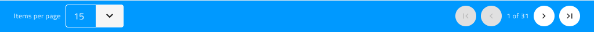

_language: ja
---

## グリッド ページング

Use the Grid Paging Component to inform the user about his current position (on which Grid page the user is currently on) and allow navigation to the previous/next and first/last pages of the Grid content. Position the Grid Paging immediately below the Grid without any gap between the two. The Grid Paging is visually identical to the [Ignite UI for Angular Grid Paging Feature](https://www.infragistics.com/products/ignite-ui-angular/angular/components/grid_paging.html)

### Grid ページング デモ

### スタイル設定

Grid ページングは、さまざまなオーバーライドでラベルや背景色などのスタイル設定に柔軟性があり、ナビゲーションに使用する Icon Buttons のスタイル設定も可能です。

## コードの生成

Sketch ダイアグラムに Paging オブジェクトが追加された場合、ページングがグリッドで有効にされます。スタイルはページング色を設定するために使用されます。

## その他のリソース

関連トピック:

- [Button](button.md)
- [Grid](grid.md)
  

コミュニティに参加して新しいアイデアをご提案ください。

