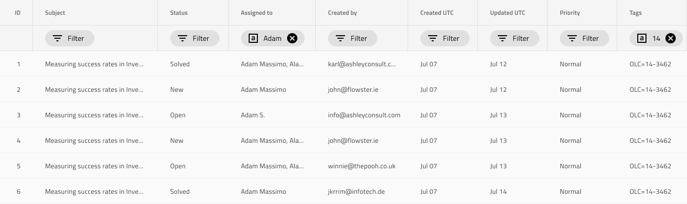

# 行フィルター

Grid 行フィルターを使用して、フィルタリング条件を持つ Chip を含む特別なタイプのヘッダー セルを介して Grid 列のフィルタリング基準を指定します。Grid 行フィルターは、[Ignite UI for Angular Grid フィルタリング機能](https://jp.infragistics.com/products/ignite-ui-angular/angular/components/grid/filtering.html)と視覚的に同じものです。

## Grid 行フィルターのデモ

## 行フィルター ヘッダー

Grid が行フィルターでフィルタリング可能であることを示すために、`ヘッダー` グループ内の Grid の各列に行フィルター ヘッダー セルを持つ 2 番目のヘッダー行を追加します。

## Filter State (フィルター状態)

行フィルター ヘッダー セルに `Filter State` のオーバーライドが設定せれます。このオーバーライドはフィルター済みに設定された場合、特定の列にフィルター条件があるかないか構成できます。フィルター条件が設定されない場合、デフォールト状態である**空**と一致します。

## その他のリソース

関連トピック:

- [Grid](grid.md)
- [Grid Excel スタイル フィルター](grid-excel-style-filter.md)
  

コミュニティに参加して新しいアイデアをご提案ください。
