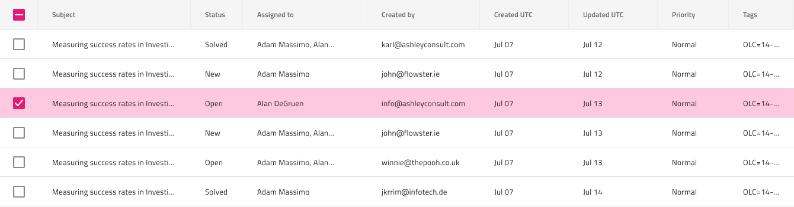

# 行選択

Grid 行選択を使用して、Grid の左端の列として表示されるチェックボックスのある特別な選択列を介して完全な行を一度に選択します。Grid 行選択は、[Ignite UI for Angular Grid 選択機能](https://jp.infragistics.com/products/ignite-ui-angular/angular/components/grid/selection.html#grid-行選択)と視覚的に同じものです。

## Grid 行選択ーのデモ

## 行選択列

Grid 行選択は、最初の列の左側に追加の列を作成し、そのヘッダーと本体セルの `Type` を `Checkbox` に設定することで実現できます。選択した行では、チェックボックスの状態を `On` に設定する必要があります。

## 行選択セル

グリッドは、`Grid Feature` オーバーライドを介して利用可能な選択された行に特別なタイプの本体セルを提供します。`RowSelected/Cell` に設定すると、選択した行に属するセルを示す区別可能なスタイルが適用されます。

## その他のリソース

関連トピック

- [Grid](grid.md)
  

コミュニティに参加して新しいアイデアをご提案ください。
