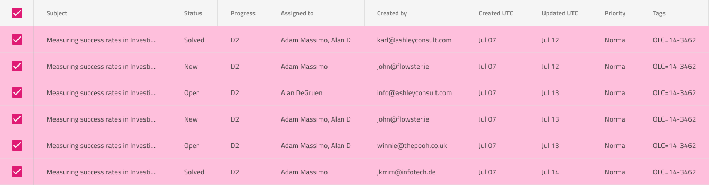

# Grid Row Selection (グリッドの行選択)

Grid Row Selection を使用して、Grid の左端の列として表示されるチェックボックスのある特別な選択列を介して完全な行を一度に選択します。Grid 行選択は、[Ignite UI for Angular Grid 選択機能](https://jp.infragistics.com/products/ignite-ui-angular/angular/components/grid/selection.html#grid-行選択)と視覚的に同じものです。

## Grid Row Selection のデモ

## 行選択列

Grid 行選択は、最初の列の左側に追加の列を作成し、その Header と Body セルの `Type` を `Row Selection` に設定することで実現できます。選択した行では、行のチェックボックスの状態を `On` に設定して、ヘッダーのチェックボックスの状態を `Indeterminate` に設定する必要があります。すべての行を選択した場合は、行の状態チェックボックスとヘッダーを `On` に設定する必要があります。

  

    

      

        

  

    

## Row Selection Cell (行選択セル)

Grid は、選択した行に対して特別なタイプの Body Cell を提供します。これを設定すると、セルが選択した行に属していることを示す識別可能なスタイルが適用されます。Figma では、グリッド セル内でネストされた `Cell State` コンポーネントを選択し、プロパティ パネルで `Row Selected` ブール値プロパティをオンにすることでこれを実現できます。

## その他のリソース

関連トピック

- [Grid](grid.md)
  

コミュニティに参加して新しいアイデアをご提案ください。
