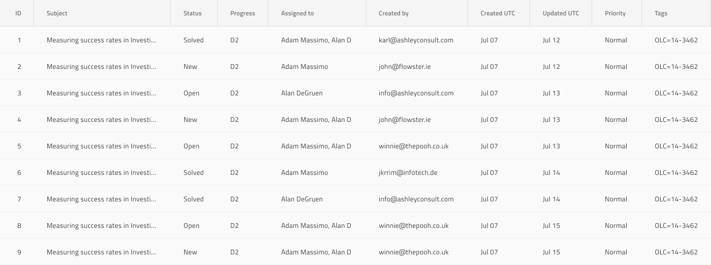
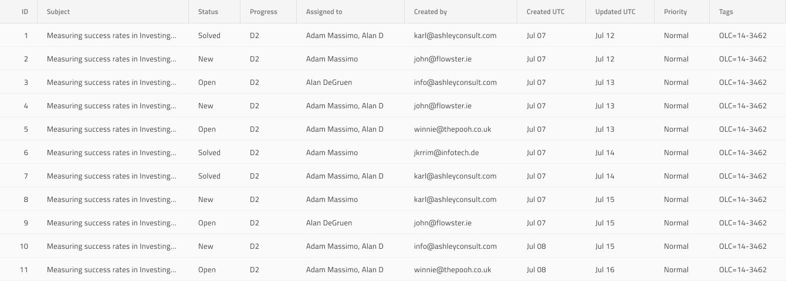
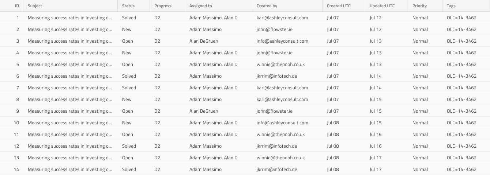

# Grid Size (グリッドのサイズ)

Grid には、3 つのサイズがあります: Large、Medium、Small。Large バリアントは最も広々としたレイアウトを提供し、Small バリアントは最もコンパクトです。Grid サイズは、[Ignite UI for Angular Grid サイズ機能](https://jp.infragistics.com/products/ignite-ui-angular/angular/components/grid/display_density.html)と視覚的に同じものです。

Grid に表示するデータが多いほど、レイアウトの密度が高くなります。これにより、Header や Body Cells、オーバーレイ、ダイアログなどのすべての要素のレイアウトに空白が次第に減少し、ツールバーや集計などメインコンテンツの上または下にグリッドに添付される要素も減少します。

## グリッド サイズ - Large

## グリッド サイズ - Medium

## グリッド サイズ - Small

> [!Note]
> Size を使用する場合は、すべての Grid 要素と機能が同じ Size タイプを使用することを確認してください。

## その他のリソース

関連トピック:

- [Grid](grid.md)
  

コミュニティに参加して新しいアイデアをご提案ください。
