# Skeleton Grid (スケレトン グリッド)

Skeleton Grid を使用して、標準の情報と同じタイプの情報をレイアウトしますが、現時点でデータが存在しない場合のアプリケーションの状態も示します。たとえば、データがリモート データ ソースから読み込まれる際、接続が不足しているか、時間がかかる場合などです。Skeleton Grid は、既知のレイアウトの [Grid](grid.md) を視覚的に表したものですが、表示するデータはありません。

## Grid のデモ

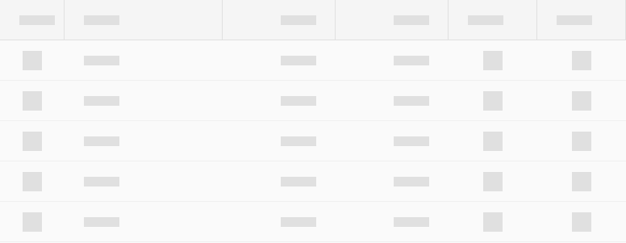

## セル タイプ

Skeleton Grid は、標準 [Grid](grid.md) と同じ 3 種類のセル (header、body、summary) をサポートします。

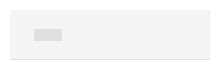

## セル表示密度

Skeleton の Header、Body、および Summary Cell は、標準 [Grid](grid.md) と同じ 3 つの表示密度バリアント (Comfortable、Cosy、Compact) をサポートします。

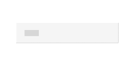
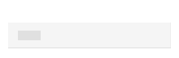

## 項目と機能 (ヘッダー セル)

Skeleton Grid は、標準 [Grid](grid.md) と同じ機能構成を、`Feature Left` および `Feature Right` のオーバーライドを介してサポートします。

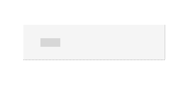
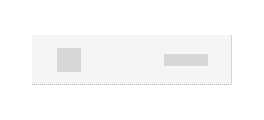
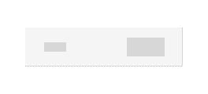

## セル タイプ

Skeleton Grid Header Cell は、標準 [Grid](grid.md) として、Number および Text、Date、Bool 型のデータのプリセットを提供します。

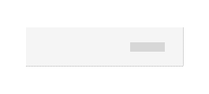
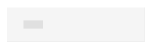

Skeleton Grid Body Cell は、Skeleton Grid Header Cell と同じデータ型のプリセットを提供し、単純なグラフィックスを視覚化する追加のアイコン タイプを含みます。

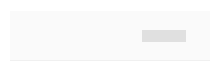
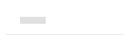
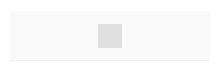

## 使用方法

グリッドを作成するときは、標準セルとスケルトン セルを組み合わせないでください。データはすべてのセルに存在するか、いずれにも存在しないため、2 つのタイプを同じグリッド レイアウト内で使用しないでください。

| 良い例                                                                                                | 悪い例                                                                                                 |
| ------------------------------------------------------------------------------------------------- | ----------------------------------------------------------------------------------------------------- |
|  |  |

## その他のリソース

関連トピック:

- [Grid](grid.md)
  

コミュニティに参加して新しいアイデアをご提案ください。
