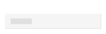
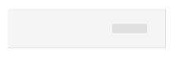

# Skeleton Grid (スケレトン グリッド)

Skeleton Grid を使用して、標準の情報と同じタイプの情報をレイアウトしますが、現時点でデータが存在しない場合のアプリケーションの状態も示します。たとえば、データがリモート データ ソースから読み込まれる際、接続が不足しているか、時間がかかる場合などです。Skeleton Grid は、既知のレイアウトの [Grid](grid.md) を視覚的に表したものですが、表示するデータはありません。

## Grid のデモ

## セル タイプ

Skeleton Grid は、標準 [Grid](grid.md) と同じ 3 種類のセル (**Header**、**Body**、**Summary**) をサポートします。

## セル サイズ

Skeleton の Header、Body、および Summary Cell は、標準 [Grid](grid.md) と同じ 3 つのサイズ バリアント (**Large**、**Medium**、**Small**) をサポートします。

## セル タイプ

Skeleton Grid Header Cell は、標準 [Grid](grid.md) として、**Number (数字)** および **Text,Date,Bool (テキスト、日付、ブール)** タイプのデータのプリセットを提供します。

Skeleton Grid Body Cell は、Skeleton Grid Header Cell と同じデータ タイプのプリセットを提供し、単純なグラフィックスを視覚化する追加の **Icon** タイプを含みます。

## 使用方法

グリッドを作成するときは、標準セルとスケルトン セルを組み合わせないでください。データはすべてのセルに存在するか、いずれにも存在しないため、2 つのタイプを同じグリッド レイアウト内で使用しないでください。

| 良い例                                                                                                | 悪い例                                                                                                 |
| ------------------------------------------------------------------------------------------------- | ----------------------------------------------------------------------------------------------------- |
|  |  |

## その他のリソース

関連トピック:

- [Grid](grid.md)
  

コミュニティに参加して新しいアイデアをご提案ください。
