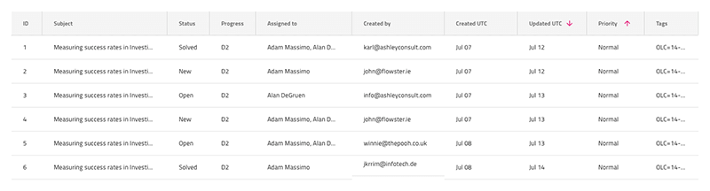

## 並べ替え

Grid 並べ替えを使用して、特定の列内の値に従って昇順および降順でレコードの順序を示します。Grid 並べ替えは、[Ignite UI for Angular Grid 並べ替え機能](https://jp.infragistics.com/products/ignite-ui-angular/angular/components/grid/sorting.html) と視覚的に同じものです。

### Grid 並べ替えのデモ

### ヘッダー セルの機能

列を並べ替え可能として示すには、`Feature Left` または `Feature Right` のオーバーライドを使用して、`Sorting `に設定します。次に、`並べ替え状態`を昇順、降順、または**並べ替えなし**に設定して、ソート順を示します。選択した順序を反映するように列の値を操作することをお勧めします。
デフォルト値のスタイルは**太字**テキストです。

## その他のリソース

関連トピック:

- [Grid](grid.md)
  

コミュニティに参加して新しいアイデアをご提案ください。
