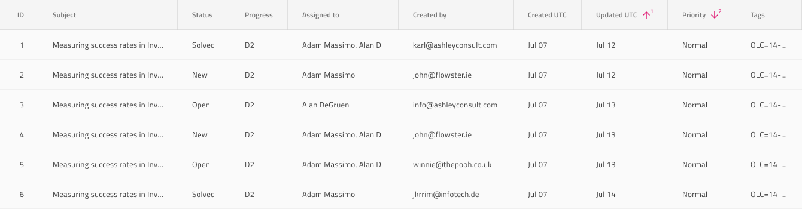

# Grid Sorting (グリッドのソート)

Grid Sorting を使用して、特定の列内の値に従って昇順および降順でレコードの順序を示します。Grid ソートは、[Ignite UI for Angular Grid ソート機能](https://jp.infragistics.com/products/ignite-ui-angular/angular/components/grid/sorting.html)と視覚的に同じものです。

## Grid Sorting のデモ

## Header Cell Feature (ヘッダー セルの機能)

Figma で列をソート可能として示すには、グリッド ヘッダー セル レイヤー内にある `Feature Left` または `Feature Right` コンポーネント インスタンスを使用し、`Type` プロパティを **Sorting Ascending**、**Sorting Descending**、または **Sorting Unsorted** に設定してソート順序を示します。選択した順序を反映するように列の値を操作することをお勧めします。

## その他のリソース

関連トピック:

- [Grid](grid.md)
  

コミュニティに参加して新しいアイデアをご提案ください。
