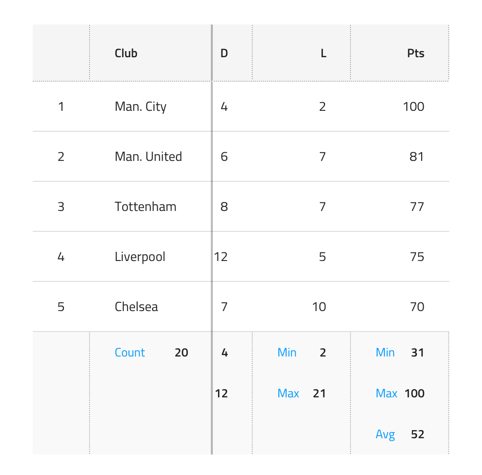
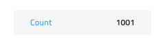
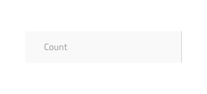
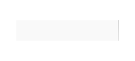
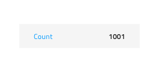
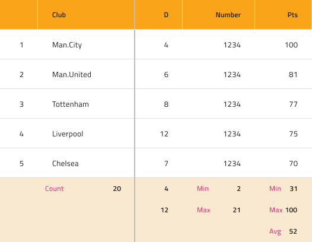
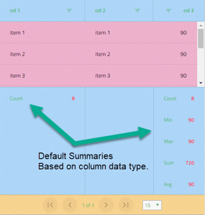

---
title: Grid 集計 - グリッド
_description: Grid 集計は、すべてのデータで算出した集計値を各 Grid 列に示します。
_keywords: デザイン システム, Sketch, Ignite UI for Angular, Grid 機能, UI ライブラリ, ウィジェット
_language: ja
---

## グリッド集計

Use the Grid Summaries Component to show aggregated values calculated over all the data in the respective Grid column. This is achievable through the insertion of special cells called Summary at the bottom of the Grid to shape up a tabular area matching the Grid structure but containing a Label and Number containing information about the aggregate value. The Grid Summaries is visually identical to the [Ignite UI for Angular Grid Summary Feature](https://www.infragistics.com/products/ignite-ui-angular/angular/components/grid/summaries.html)

### Grid 集計デモ

### 状態

Grid 集計セルは、以下のインタラクティブな状態をサポートします。**アクティブ**は Label および Number の概要を示します。インアクティブは、グレー アウトされたラベルを示します。Number を非表示にします。unavailable は 1 つの列に他の列より集計が少ない場合にギャップを埋めます。

### タイプ

Grid 集計セルには一般的なタイプのプリセットが 2 タイプあり、数値の **Number** と文字列の Text に対応する必要があります。

### スタイル設定

Grid 集計セルは、さまざまなオーバーライドでラベル、数値テキスト色、セルの背景色を制御することにより柔軟にスタイル設定できます。

## コードの生成

Sketch ダイアグラムに Summary オブジェクトが 1 つ以上追加された場合、それらの集計が各関連する列で生成されます。開発者がカスタム集計計算のクラスを設定する必要があります。詳細については、この [Ignite UI for Angular ヘルプ トピック](https://jp.infragistics.com/products/ignite-ui-angular/angular/components/grid_summaries.html)を参照してください。コード生成は Sketch の Summary スタイルを SCSS に適用します。集計クラスが設定されていない場合、プロジェクトをブラウザーで実行するときにデフォルトの列集計が以下の画像のように列型に基づいて描画されます。

> [!Note]
> Ignite UI Summary Theme の描画に問題があり、背景色機能で色が描画されませんが、Header 色は描画されます。修正後に Sketch 描画に設定した正しい色で描画されます。

## その他のリソース

関連トピック:

- [Grid](grid.md)
  

コミュニティに参加して新しいアイデアをご提案ください。

