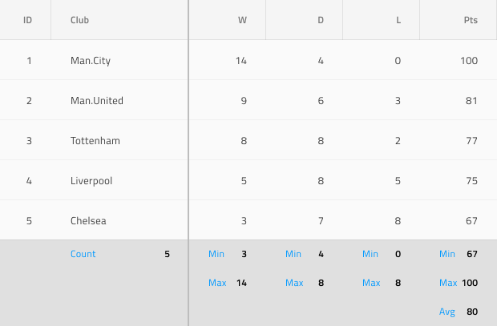

# Grid Summaries (グリッド集計)

Grid 集計のコンポーネントは、各グリッド列のすべてのデータで算出された集計値を示すために使用します。グリッドの下にある特定のセル集計を挿入して表領域をグリッド構造と一致させますが、含まれる Label と Number は集計値の情報を含みます。Grid 集計は、[Ignite UI for Angular Grid 集計機能](https://jp.infragistics.com/products/ignite-ui-angular/angular/components/grid/summaries.html)と視覚的に同じものです。

## Grid 集計のデモ

## 状態

Grid Summary Cell は、次のインタラクティブな状態をサポートします。**available** は Label および Number を示します。**unavailable** は、1 つの列に他の列より集計が少ない場合にギャップを埋めます。Sketch ではこれを `Symbol Overrides` で実現していますが、Adobe XD では `Component States` パラダイムを使用して簡単に状態を切り替えることができます。Figma で状態を切り替えるには、プロパティ パネル内にある専用の `Type` プロパティを使用する必要があります。

## タイプ

Grid Summary Cell には一般的なタイプのプリセットが 2 タイプあり、数値の **Number** と文字列の **Text** に対応する必要があります。

## スタイル設定

Grid Summary Cell は、さまざまなオプションを通じてラベル、数値テキスト色、セルの背景色を柔軟にスタイル設定できます。

## その他のリソース

関連トピック:

- [Grid](grid.md)
  

コミュニティに参加して新しいアイデアをご提案ください。

