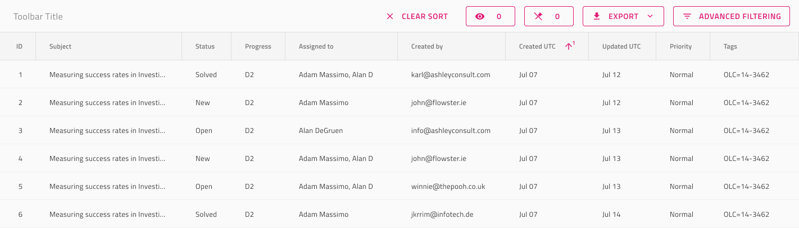

## Grid ツールバー

Grid ツールバーは、グリッド全体の外観と動作に影響するアクションを定義するために使用します。デフォルトでは、ツールバーに列の表示/非表示、ピン固定/ピン固定解除、および Grid コンテンツをさまざまな形式でエクスポートするためのアクションが含まれます。Grid ページングは、[Ignite UI for Angular Grid ツールバー機能](https://jp.infragistics.com/products/ignite-ui-angular/angular/components/grid/toolbar.html) と視覚的に同じものです。

### Grid ツールバーのデモ

### スタイル設定

Grid ツールバーには、アクションのさまざまなオーバーライド、タイトル スタイルおよび背景色により、スタイル設定は高い柔軟性があります。

## コードの生成

> [!WARNING]
> デザイン内のツールバーのインスタンスで `Detach from Symbol` をしないでください。そうでない場合、正しく生成されません。

ツールバーは、ヘッダーグループと本体グループの兄弟としてグリッドを定義するグループ内に配置してください。

### Title (タイトル)

このオーバーライドは ツール バー 内で表示するテキストを制御します。

### Action 1, 2 および 3 (アクション 1、2 および 3)

これらのオーバーライドは、ツールバーで使用可能なアクションをコントロールするために使用されます。次が使用可能なオプションです。

#### ButtonExport

このオプションはツールバーに[エクスポート](https://jp.infragistics.com/products/ignite-ui-angular/angular/components/grid/toolbar.html#機能) ボタンを追加し、グリッドの `Excel へエクスポート`および `CSV へエクスポート`機能を直接有効にします。

#### ButtonHiding

このオプションはツールバーに [列非表示](https://jp.infragistics.com/products/ignite-ui-angular/angular/components/grid/column_hiding.html)  ボタンを追加します。これは、ユーザーがどの列を表示にするかまたは非表示にするかを操作できる UI 要素です。

#### ButtonPinning

このオプションはツールバーに [列ピン固定](https://jp.infragistics.com/products/ignite-ui-angular/angular/components/grid/toolbar.html#機能) ボタンを追加します。これは、ユーザーがどの列をピン固定にするかを操作できる UI 要素です。

#### Switch, Icon & Button (スイッチ、アイコン、ボタン)

スイッチ、アイコン、ボタンのオプションは[カスタム コンテンツ](https://jp.infragistics.com/products/ignite-ui-angular/angular/components/grid/toolbar.html#カスタム-コンテンツ-テンプレート)と見なされます。 デフォルトでは、ツールバーに含まれていません。これらをツールバー内で描画するために、コード生成はツールバーが使用するこれらのコンポーネントを含む `ng-template` を生成します。

## その他のリソース

関連トピック:

- [Grid](grid.md)
- [Grid 列非表示](grid-column-hiding.md)
- [Grid 列ピン固定](grid-column-pinning.md)
- [Grid エクスポート](grid-export.md)
  

コミュニティに参加して新しいアイデアをご提案ください。
