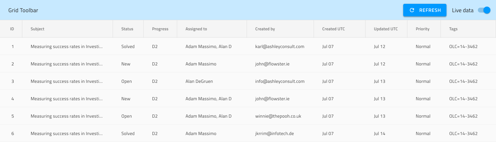

# Grid Toolbar (グリッド ツールバー)

Grid Toolbar は、グリッド全体の外観と動作に影響するアクションを定義するために使用します。デフォルトでは、ツールバーに列の表示/非表示、ピン固定/ピン固定解除、および Grid コンテンツをさまざまな形式でエクスポートするためのアクションが含まれます。Grid ツールバーは、[Ignite UI for Angular Grid ツールバー機能](https://jp.infragistics.com/products/ignite-ui-angular/angular/components/grid/toolbar.html)と視覚的に同じものです。

## Grid Toolbar のデモ

## レイアウト

Grid Toolbar は、Figma の自動レイアウトを使用し、交換可能なデフォルト操作とカスタム操作を備えているため、コンテンツとレイアウトを完全に自由に変更できます。アクションが必要ない場合は、レイヤー パネルからアクションを非表示にするだけで、レイアウトが適切に調整されます。

  

    

## スタイル設定

Grid ツールバーには、Actions のさまざまなオプション、タイトル スタイル、背景色によるスタイルの柔軟性があります。

## その他のリソース

関連トピック:

- [Grid](grid.md)
- [Grid 列非表示](grid-column-hiding.md)
- [Grid 列ピン固定](grid-column-pinning.md)
- [Grid エクスポート](grid-export.md)
  

コミュニティに参加して新しいアイデアをご提案ください。
