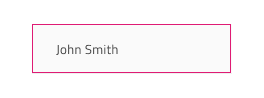

# Grid (グリッド)

Grid コンポーネントは複雑で大規模なデータを表形式のレイアウトで表示し、ユーザーがブラウジングやインタラクティブに操作することにより、フィルタリング、ソート、ページングなどが可能です。Grid は、[Ignite UI for Angular Grid コンポーネント](https://jp.infragistics.com/products/ignite-ui-angular/angular/components/grid.html)と視覚的に同じものです。

## Grid のデモ

## Figma で Grid を使用

Grid は、基本的に表形式のレイアウトでデータを表示する列と行のリピーターです。したがって、最も簡単な使用方法は、定義済みのグリッドの 1 つをフレームにドラッグすることです。サポートされる 3 つの[サイズ](grid-sizes.md)に 3 つのプリセットがあります。Figma では、Grid コンポーネントは列に基づいた構造を持っていることに注意してください。つまり、行全体ではなく、列全体を即座に削除または非表示にすることができます。グリッドを挿入したら、ヘッダーと本文セルの編集を開始したり、グリッド全体の幅のサイズを変更したりできます。ただし、グリッド構造をさらに調整したい場合 (列または行の削除、列の幅の変更など) は、グリッドを右クリックし、コンテキスト メニューの `Detach instance` オプションを使用する必要があります。

事前にデタッチしなくても、レイヤー パネルのコンポーネント名の下に次の構造が表示されます。

| レイヤー                                    | 使用                                                                                                                                                  |
| ---------------------------------------- | ---------------------------------------------------------------------------------------------------------------------------------------------------- |
| 🚫 componentVersion &nbsp;&nbsp; | 禁止されたアイコンで開始する特定のロックされたレイヤー。禁止されたアイコンで開始する特定のロックされたレイヤー。この層はコード生成に必要であり、コンポーネントのバージョンに関する情報を保持します。削除や変更は避けてください。|
| 🚫 metadata | 禁止されたアイコンで開始する特定のロックされたレイヤー。このレイヤーはコード生成に必要なため、削除または変更しないでください。|
| Column 1                                 | 列のすべてのセルが含まれます - Header と Body Cell                                                                                                                 |
| ...                                   | 1 と 7 の間の列                                                                        |
| Column 7                                 | 列のすべてのセルが含まれます - Header と Body Cell                                                                                                                 |

デタッチ後、既存の列を複製することにより、グリッド内の列の数を増やすことができます。レイヤー パネルには、各 Column の次の構造が表示されます。

| レイヤー                                    | 使用                                                                                                                                                  |
| ---------------------------------------- | ---------------------------------------------------------------------------------------------------------------------------------------------------- |
| 🚫 metadata | 禁止されたアイコンで開始する特定のロックされたレイヤー。このレイヤーはコード生成に必要なため、削除または変更しないでください |
| Header                                 | 特定のヘッダー セルを含みます。                                                                                                                   |
| Body Cell 1                                 | 特定の本文セルを含みます。                                                                                                                   |
| ...                                   | 1 と 9 の間のセル                                                                        |
| Body Cell 9                                 | 特定の本文セルを含みます。                                                                                                                   |

本文セルの数を増やすには、まず特定の列で `Detach instance` オプションを使用してから、列内にすでに存在する本文セルを複製する必要があります。列またはセルの数を増減した後、Grid コンポーネントのサイズを手動で調整する必要があります。

## セル タイプ

Grid は、異なるデータ可視化用に 3 タイプのセルがあります。Header Cell は、各列に 1 つ、Grid の一番上に表示され、特定の列のデータに関する説明をテキストで表示します。Body Cell は、データ レコードを表示するコンテンツ テーブルのビルドを作成するために使用され、そのタイプは異なる場合があります。Summary Cell は、[集計](grid-summaries.md)列がカウント、最大、最小などの各ディメンションに表示される Grid の下のセクションを作成するために使用されます。

Header Cell には、Row Filter Header Cell という特別なサブタイプが 1 つあります。Row Filter Header Cell を使用して、[行フィルター](grid-row-filter.md)機能を有効にするために Header の下部に追加のヘッダー行を作成します。

## セル サイズ

Header、Body、および Summary Cell は、Grid コンポーネントのサイズに応じて 3 つのバリアントをサポートしています: Large、Medium、および Small。Figma では、セルのサイズと内部のコンテンツはプロパティ パネルから個別に変更できるプロパティです。

> [!NOTE]
> 特定のサイズの Grid コンポーネントを選択した後は、グリッド セルのサイズを変更しないことをお勧めします。

## 項目と機能 (ヘッダー セル)

グリッド ヘッダー セルは、`Items` インスタンスでさまざまなレイアウトの組み合わせをサポートし、`Feature Left`、`Feature Right`、`Right Border` でさまざまな機能構成をサポートします。

## 状態と Grid 機能 (本文セル)

Grid Body Cell は、以下のインタラクティブな状態をサポートします: **Idle (アイドル)** (デフォルトの状態)、**Selected (選択済み)**、**Active (アクティブ)** および **Focused (フォーカス済み)**。任意の時間に、グリッド内の 1 つのセルだけがアクティブまたはフォーカスされます。

Grid Body Cell は、ヘッダーで定義された一部の Grid 機能のスタイル設定をサポートしています。通常のセル、編集可能なセル、および選択した行に属するセルには、スタイルのバリアントがあります。Figma では、本文セルのさまざまな状態間の切り替えは、プロパティ パネルの `Cell State`、`Row Selected`、および `Row Editing` プロパティを通じて実現されます。

## セル タイプ

Figma では、Grid Header Cell は、グリッドが対応する必要があるデータの種類に対して 5 つのプリセットを提供します。数値の **Number**、それぞれのデータ タイプの **Text,Date,Bool** (テキスト、日付、ブール) を組み合わせたもの; 複数の行を選択する場合に最初の列に使用される **Row Selection**; グループ化されたデータ行を展開および縮小するために使用される Group By; ユーザーが本文セル内のコンテンツに関連する特定のフィルター オプションをアクティブ化できる場所で使用される **Row Filter** の 2 つのオプション (Empty または Filtered) です。

Grid Body Cell には、単純なグラフィックスを視覚化する追加のアイコン タイプと、空の本文セルを表示するために使用されるスペーサー タイプを備えた Header Cell のような、同じ汎用タイプのデータのプリセットが提供されます。

## Grid の水平スクロール

Figma で水平スクロールを実現するには、実際のグリッド幅より小さいサイズでフレーム内に Grid を追加し、プロパティ パネルからクリッピング オプションを有効にする必要があります。次に、プロパティ パネルの上部にある `Prototype` タブに移動し、スクロールを水平に設定する必要があります。同じ結果を達成するためのもう 1 つのオプションは、グリッド コンポーネントをデタッチすることです。その後、フレーム サイズを縮小し、プロパティ パネルからクリッピング オプションを有効にする必要があります。マスクを追加することもできます。塗りつぶし付きの四角形を挿入し、必要に応じてディメンションを設定し、Layers パネルのグリッドの下に配置するだけです。次に、グリッドと四角形の両方を選択し、右クリックしてコンテキスト メニューから `Use as mask` オプションを選択します。

## スタイル設定

Grid は、さまざま状態の各セル テキスト、アイコン、背景色のスタイル設定や水平および垂直の境界線の非表示など柔軟に変更できます。

## 使用方法

Grid の最も重要な点は、Header および Body セル内のデータの配置です。テキストは常に左揃えにして変数空スペースを右に残し、数値は常に右揃えにして変数空スペースを左に残します。

| 良い例                                                                                                | 悪い例                                                                                               |
| ------------------------------------------------------------------------------------------------- | ----------------------------------------------------------------------------------------------------- |
|  |  |

## その他のリソース

関連トピック:

- [Grid ツールバー](grid-toolbar.md)
- [Grid エクスポート](grid-export.md)
- [Grid グループ化](grid-grouping.md)
- [Grid 列ピン固定](grid-column-pinning.md)
- [Grid 列非表示](grid-column-hiding.md)
- [Grid 列移動](grid-column-moving.md)
- [Grid 列サイズ変更](grid-column-resizing.md)
- [Grid ソート](grid-sorting.md)
- [Grid 行フィルター](grid-row-filter.md)
- [Grid Excel スタイル フィルター](grid-excel-style-filter.md)
- [Grid 行選択](grid-row-selection.md)
- [Grid 編集](grid-editing.md)
- [Grid サイズ](grid-sizes.md)
- [Grid ページング](grid-paging.md)
- [Grid 集計](grid-summaries.md)
- [Hierarchical Grid](hierarchical-grid.md)
- [Tree Grid](tree-grid.md)
- [Grid パターン](../patterns/grid.md)
- [Grid Skeleton](grid-skeleton.md)
  

コミュニティに参加して新しいアイデアをご提案ください。
