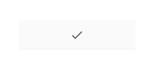

## Grid (グリッド)

グリッド コンポーネントは大量の複雑なデータをタブ形式で表示し、ユーザーがブラウジングやインタラクティブに操作することにより、フィルタリング、並べ替え、ページングなどが可能です。Grid は、[Ignite UI for Angular Grid コンポーネント](https://jp.infragistics.com/products/ignite-ui-angular/angular/components/grid.html) と視覚的に同じものです。

### グリッドのデモ

### Detach from Symbol (シンボルからデタッチ)

グリッドは、基本的に表形式でデータを表示する列と行のリピーターです。したがって、最も簡単な使用方法は、定義済みのグリッドの 1 つをアートボードにドラッグすることです。サポートされる 3 つの[表示密度](grid-display-density.md) に 3 つのプリセットがあります。アートボードを開いた後、その上を右クリックし、コンテキスト メニューの下部にある `Detach from Symbol` オプションを選択すると、新しく表示されたグループの下のレイヤー パネルに次のように表示されます。

| レイヤー                                    | 使用                                                                                                                                                  |
| ---------------------------------------- | ---------------------------------------------------------------------------------------------------------------------------------------------------- |
| 🚫 igx-grid/_(comfortable/cosy/compact)_ | 禁止されたアイコンで開始する特定のロックされたレイヤー。 このレイヤーはコード生成に必要なため、削除または変更しないでください |
| Header                                   | ヘッダーのすべてのセルを取得します                                                                                                             |
| Body                                     | 本体のすべてのセルを含みます                                                                                                                 |
| 🕹️PrimaryKey                             | 一部のグリッド機能で必要であり、コード生成エンジンで使用されるレコードの主キーを持つ列の参照       |
| 🕹️DataSource                             | コード生成エンジンによって使用され、グリッドにバインドされるデータ ソースの参照                                             |

デタッチ後、既存のデータ行の 1 つを複製するだけで、データのすべてのディメンションを表示するために必要なヘッダーの数を変更できます。デザインに表示したい表示レコード (数に制限がない) を挿入することもできます。

### セル タイプ

グリッドは、異なるデータ可視化用に 3 タイプのセルがあります。Header Cell (ヘッダー セル) は、各列に 1 つ、グリッドの一番上に表示され、特定の列のデータに関する説明をテキストで表示します。Body Cell (本体セル) は、データ レコードを表示するコンテンツ テーブルのビルドを作成するために使用され、そのタイプは異なる場合があります。Summary Cell (集計セル) は、[集計](grid-summaries.md) 列がカウント、最大、最小などの各ディメンションに表示される Grid の下のセクションを作成するために使用されます。

ヘッダー セルには、行フィルター ヘッダー セルという特別なサブタイプが 1 つあります。行フィルターヘッダーセルを使用して、[行フィルター](grid-row-filter.md) 機能を有効にするためにヘッダーの下部に追加のヘッダー行を作成します。

### セル 表示密度

ヘッダー、本体、および 集計セルは、グリッドの 3 つの表示密度バリアントをサポートします。以下のボディ セルに見られるように、それぞれに異なるシンボルが付いています:

### 項目と機能 (ヘッダー セル)

Grid ヘッダー セルは、`Items` のオーバーライドでさまざまなレイアウトの組み合わせをサポートします。また、`Feature Left` および `Feature Right` のオーバーライドを介して機能の複数の構成をサポートします。さらに、[編集](grid-editing.md)、[移動](grid-column-moving.md)、[サイズ変更](grid-column-resizing.md)、[非表示](rid-column-hiding.md) など、表示されていないがグリッドの異なる列機能を有効にする追加のオーバーライドがあります。

### 状態とグリッド機能 (本体セル)

Grid 本体セルは、以下のインタラクティブな状態をサポートします: 標準状態の **Inactive**、フォーカスのある/選択されたセルでは Active です。
デフォルト値は、**太字**テキストでスタイル設定されます。

Grid 本体セルは、ヘッダーを介して `Grid Feature` のオーバーライドによって定義されるいくつかのグリッド機能のスタイル設定サポートがあります。通常のセル、編集可能なセル、および選択した行に属するセルにスタイル設定されたセルへのアクセスを提供します。

### セル タイプ

Grid ヘッダー セルは、グリッドの対応に必要な一般的なデータ型のプリセットが 3 つあります。数値に使用する **Number**、文字列の Text、ブールデータを含む列に使用されるまたは複数行の選択を可能にするための最初の列のテンプレートとして使用される Checkbox。

Grid 本体セルは、ヘッダー セルの同じ一般的なデータ型のプリセットを提供し、単純なグラフィックスを視覚化する追加のアイコンタイプを含みます。

### グリッドの水平スクロール

絶対幅として、または親グループ/コンテナに関連する特定のグリッド ディメンションを達成する 1 つの方法は、グリッドのメイン グループ内にマスクを追加することです。スタイル設定なしで長方形を挿入し、必要に応じてそのサイズを設定します。下の画像では、常に正確に 800px 幅のグリッドがあります。

長方形の幅と高さを固定し、名前を `Mask` に変更し、レイヤー パネルの特別なシンボル `🕹️DataSource` のすぐ上に配置します。次に、長方形の上を右クリックし、コンテキスト メニューの下部にある `マスク` オプションを選択します。

これでグリッド グループがマスクのディメンションを取得し、水平スクロールなしでグリッドを使用することと同じ方法でレイアウトで使用できます。このコンポーネントのコードが生成されると、グリッドのディメンションとしてマスクのディメンションを基準する水平スクロールバーが自動的に追加されます。

### スタイル設定

グリッドは、さまざま状態の各セル テキスト、アイコン、背景色のスタイル設定や水平および垂直の境界線の非表示など柔軟に変更できます。

## 使用方法

グリッドの最も重要な点は、ヘッダーおよび本体セル内のデータの配置です。テキストは常に左揃えにして変数空スペースを右に残し、数値は常に右揃えにして変数空スペースを左に残します。

| 良い例                                                                                                | 悪い例                                                                                               |
| ------------------------------------------------------------------------------------------------- | ----------------------------------------------------------------------------------------------------- |
|  |  |

## コードの生成

このセクションは、オーバーライドとコード生成にどのような影響があるかについて説明します。

> [!WARNING]
> グリッドを使用するためにデタッチ シンボルに設定する**必要**があります。

> [!NOTE]
> グリッドの高さはデフォルトで `100％` に設定されています。

### データ ソース プロパティ

提供された場合、`🕹️DataSource` 値はグリッドのデータ ソースを構成するために使用されます。各列名がオブジェクトのプロパティであるオブジェクトの配列に設定する必要があります。データ ソースが設定されない場合、グリッドは列ヘッダーのみを描画します。

### プライマリ キー

提供された場合、 `🕹️PrimaryKey` 値は グリッドの `primaryKey`プロパティを設定するために使用されます。このプロパティの値は、一意の値を含むデータ ソース内のプロパティ名にする必要があります。このプロパティは、グリッドで[行編集バナー](https://jp.infragistics.com/products/ignite-ui-angular/angular/components/grid/row_editing.html)を使用する場合に特に重要です。

### Header (ヘッダー)

提供された場合、ヘッダーは描画する列数を決定します。ヘッダーを下にある本体 (セル) と一致させるために列を作成します。一致する本体が見つからない場合、列はヘッダーの情報に基づいて作成されます。一致が見つかった場合、情報がヘッダーから取得され、次に本体/セルから取得されます。

ヘッダーには、いくつかのサイズ変更オプションがあります。Sketch で各ヘッダーセ ルを左右にピン固定すると、HTML で列 (パーセント幅) が生成されます。これにより、グリッドのサイズに応じて列を拡大または縮小できます。あるいは、ヘッダー セルの幅を固定すると、そのサイズの固定列を生成します。

#### タイプ

設定された場合、列の型 (string、number、Boolean) を決定するために使用されます。

#### テキスト

ヘッダーの Text プロパティにテキスト、[テキストのバインディング](../codegen/data-binding.md)、または両方を含むことができます。例:

- 設定
- {settingsLabel}
- 重要な {labelText}

#### Feature Left および Feature Right

これらのオーバーライドは、個々の列で有効にする機能を制御します。以下の値を使用できます。

- None (デフォルト)
- フィルタリング ([Excel スタイル フィルタリング](https://jp.infragistics.com/products/ignite-ui-angular/angular/components/grid/excel_style_filtering.html))
- ピン固定
- 並べ替え

#### Column Moving (列移動)

このオーバーライドは、ユーザーが列を移動できるかどうかを決定します。

#### Column Resizing (列サイズ変更)

このオーバーライドは、ユーザーが列のサイズを変更できるかどうかを決定します。

#### Column Hiding (列非表示)

このオーバーライドは、列が非表示かどうかを決定します。

### Body/Cell (本体/セル)

提供された場合、本体 (セル) は描画する列の数を決定します。ヘッダーを本体 (セル) と一致しようとします。一致するヘッダーが見つからない場合、列は本体/セルの情報に基づいて作成されます。一致が見つかった場合、情報がヘッダーから取得され、次に本体/セルから取得されます。

#### データ プロパティ

提供された場合、 `🕹️DataProperty` は列のフィールドを構成するために使用されます。列のフィールドは `🕹️DataSource` のフィールドに相対します。.

#### タイプ

設定された場合、列の型 (string、number、Boolean) を決定するために使用されます。

## その他のリソース

関連トピック:

- [Grid ツールバー](grid-toolbar.md)
- [Grid エクスポート](grid-export.md)
- [Grid グループ化](grid-grouping.md)
- [Grid 列ピン固定](grid-column-pinning.md)
- [Grid 列非表示](grid-column-hiding.md)
- [Grid 列移動](grid-column-moving.md)
- [Grid 列サイズ変更](grid-column-resizing.md)
- [Grid 並べ替え](grid-sorting.md)
- [Grid 行フィルター](grid-row-filter.md)
- [Grid Excel スタイル フィルター](grid-excel-style-filter.md)
- [Grid 行選択](grid-row-selection.md)
- [Grid 編集](grid-editing.md)
- [Grid 表示密度](grid-display-density.md)
- [Grid ページング](grid-paging.md)
- [Grid 集計](grid-summaries.md)
- [Hierarchical Grid](hierarchical-grid.md)
- [Tree Grid](tree-grid.md)
- [Grid パターン](../patterns/full-grid.md)
- [データ バインディング](../codegen/data-binding.md)
  

コミュニティに参加して新しいアイデアをご提案ください。
