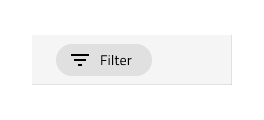
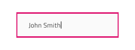
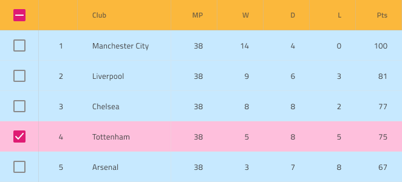

# Grid (グリッド)

Grid コンポーネントは大量の複雑なデータをタブ形式で表示し、ユーザーがブラウジングやインタラクティブに操作することにより、フィルタリング、並べ替え、ページングなどが可能です。Grid は、[Ignite UI for Angular Grid コンポーネント](https://jp.infragistics.com/products/ignite-ui-angular/angular/components/grid.html)と視覚的に同じものです。

## Grid のデモ

## Using the Grid in Sketch

Grid は、基本的に表形式でデータを表示する列と行のリピーターです。したがって、最も簡単な使用方法は、定義済みの Grid の 1 つをアートボードにドラッグすることです。サポートされる 3 つの[表示密度](grid-display-density.md)に 3 つのプリセットがあります。アートボードを開いた後、その上を右クリックし、コンテキスト メニューの下部にある `Detach from Symbol` オプションを選択すると、新しく表示されたグループの下のレイヤー パネルに次のように表示されます。

| レイヤー                                    | 使用                                                                                                                                                  |
| ---------------------------------------- | ---------------------------------------------------------------------------------------------------------------------------------------------------- |
| 🚫 metadata | 禁止されたアイコンで開始する特定のロックされたレイヤー。このレイヤーはコード生成に必要なため、削除または変更しないでください |
| Header                                   | ヘッダーのすべてのセルを取得します                                                                                                             |
| Body                                     | 本体のすべてのセルを含みます                                                                                                                 |

デタッチ後、既存のデータ行の 1 つを複製するだけで、データのすべてのディメンションを表示するために必要なヘッダーの数を変更できます。デザインに表示したい表示レコード (数に制限がない) を挿入することもできます。

## Using the Grid in Adobe XD

In Adobe XD, after you choose one of the three [preset display density grid components](grid-display-density.md) and drag it to your artboard, you will notice in the layers panel that we use `Repeat Grid` for both the Header and the Body to speed configuration up. Unlike in Sketch in Adobe XD destroying the symbol is not necessary. You should see the following in your layers panel:

| Layer                                    | Use                                                                                                                                                  |
| ---------------------------------------- | ---------------------------------------------------------------------------------------------------------------------------------------------------- |
| 🚫 metadata | A special locked layer starting with a prohibited icon. This layer is required by the code generation and you should avoid deleting or modifying it. |
| Header                                   | Contains all header cells grouped in a Header Repeat Grid                                                                                                         |
| Body                                     | Contains all body cells grouped in a Body Repeat Grid                                                                                                                   |

When you select the Header or Body Repeat Grid layer, you may alter the number of the repeated cells you need by dragging the green handles at the right or bottom edge to show all the dimensions of your data and insert as many visible records as you want to show in your design. To change a particular cell type or column width, you have to select the Repeat Grid layer and click `Ungroup Grid` in the right panel. This will allow you to work the cells separately to achieve the desired design.

## セル タイプ

Grid は、異なるデータ可視化用に 3 タイプのセルがあります。Header Cell は、各列に 1 つ、Grid の一番上に表示され、特定の列のデータに関する説明をテキストで表示します。Body Cell は、データ レコードを表示するコンテンツ テーブルのビルドを作成するために使用され、そのタイプは異なる場合があります。Summary Cell は、[集計](grid-summaries.md)列がカウント、最大、最小などの各ディメンションに表示される Grid の下のセクションを作成するために使用されます。

Header Cell には、Row Filter Header Cell という特別なサブタイプが 1 つあります。Row Filter Header Cell を使用して、[行フィルター](grid-row-filter.md)機能を有効にするために Header の下部に追加のヘッダー行を作成します。

## セル表示密度

Header、Body、および Summary セルは、Grid の 3 つの表示密度バリアントをサポートします: comfortable、cosy、および compact。以下のヘッダー セルに見られるように、それぞれに異なるシンボルが付いています:

## 項目と機能 (ヘッダー セル)

Grid Header Cell は、`Items` のオーバーライドでさまざまなレイアウトの組み合わせをサポートします。また、`Feature Left` および `Feature Right` のオーバーライドを介して機能の複数の構成をサポートします。さらに、[編集](grid-editing.md)、[移動](grid-column-moving.md)、[サイズ変更](grid-column-resizing.md)、[ピン固定](grid-column-pinning.md)など、表示されていないが Grid の異なる列機能を有効にする追加のオーバーライドがあります。

## 状態と Grid 機能 (本体セル)

Grid Body Cell は、以下のインタラクティブな状態をサポートします: 標準状態の **Inactive**、フォーカスのある/選択されたセルでは Active です。任意の時間に、グリッド内の 1 つのセルだけをアクティブにすることができます。

Grid Body Cell は、ヘッダーを介して `Grid Feature` のオーバーライドによって定義されるいくつかの Grid 機能のスタイル設定サポートがあります。通常のセル、編集可能なセル、および選択した行に属するセルにスタイル設定されたセルへのアクセスを提供します。

## セル タイプ

Grid Header Cell は、Grid が対応する必要のある 4 つの一般的なタイプのデータのプリセットを提供します: 数値の **Number**、それぞれのデータ タイプの Text、Date、Bool を組み合わせたもの、複数の行を選択する場合に最初の列に使用される Row Selection と、グループ化されたデータ行を展開および縮小するために使用される Group By。

Grid Body Cell は、Header Cell の同じ一般的なデータ型のプリセットを提供し、単純なグラフィックスを視覚化する追加のアイコン タイプを含みます。

## Grid の水平スクロール

絶対幅として、または親グループ/コンテナに関連する特定の Grid ディメンションを達成する 1 つの方法は、Grid のメイン グループ内にマスクを追加することです。スタイル設定なしで長方形を挿入し、必要に応じてそのサイズを設定します。下の画像では、常に正確に 800px 幅の Grid があります。

長方形の幅と高さを固定し、名前を `Mask` に変更し、レイヤー パネルの下部に配置します。次に、長方形の上を右クリックし、コンテキスト メニューの下部にある `Mask` オプションを選択します。

これで Grid のグループが Mask のディメンションを取得し、水平スクロールなしで Grid を使用することと同じ方法でレイアウトで使用できます。このコンポーネントのコードが生成されると、Grid のディメンションとしてマスクのディメンションを基準とする水平スクロールバーが自動的に追加されます。

## スタイル設定

Grid は、さまざま状態の各セル テキスト、アイコン、背景色のスタイル設定や水平および垂直の境界線の非表示など柔軟に変更できます。

## 使用方法

Grid の最も重要な点は、Header および Body セル内のデータの配置です。テキストは常に左揃えにして変数空スペースを右に残し、数値は常に右揃えにして変数空スペースを左に残します。

| 良い例                                                                                                | 悪い例                                                                                               |
| ------------------------------------------------------------------------------------------------- | ----------------------------------------------------------------------------------------------------- |
|  |  |

## その他のリソース

関連トピック:

- [Grid ツールバー](grid-toolbar.md)
- [Grid エクスポート](grid-export.md)
- [Grid グループ化](grid-grouping.md)
- [Grid 列ピン固定](grid-column-pinning.md)
- [Grid 列非表示](grid-column-hiding.md)
- [Grid 列移動](grid-column-moving.md)
- [Grid 列サイズ変更](grid-column-resizing.md)
- [Grid 並べ替え](grid-sorting.md)
- [Grid 行フィルター](grid-row-filter.md)
- [Grid Excel スタイル フィルター](grid-excel-style-filter.md)
- [Grid 行選択](grid-row-selection.md)
- [Grid 編集](grid-editing.md)
- [Grid 表示密度](grid-display-density.md)
- [Grid ページング](grid-paging.md)
- [Grid 集計](grid-summaries.md)
- [Hierarchical Grid](hierarchical-grid.md)
- [Tree Grid](tree-grid.md)
- [Grid パターン](../patterns/grid.md)
- [Grid Skeleton](grid-skeleton.md)
  

コミュニティに参加して新しいアイデアをご提案ください。
